[TOC]


C:\Users\Admin\AppData\Local\Programs\Python\Python38-32\python.exe E:/programing/language/python/python-docs/readfile.py
======== name dir ========
## 01 Welcome  Start Here
### 001 How to Get Help
### 002 Intro - Our First App

https://www.udemy.com/course/the-modern-angular-bootcamp/

### 003 A Few Questions Answered
### 004 Environment Setup - Node JS.html

**To work with Angular on our local machines, Node JS must be installed.**

**To check if you have Node already installed, open up a terminal window and run** `node -v`

- If you see a number **greater or equal to 10.9.0** printed out, you are good to go! Continue on to the next lecture
- If you see a number **less than 10.9.0,** you need to update Node JS. You can do so by downloading an installer here and running it: https://nodejs.org/en/download/
- **If you get an error message,** you need to download and install Node JS. You can do so by downloading an installer here and running it: https://nodejs.org/en/download/

### 005 Environment Setup - Angular CLI.html

**To generate a new Angular project, we need to install the Angular CLI.**

**You can do so by running** `npm install -g @angular/cli`

- Did you run this command and everything **appeared to work ok**? Great! **Continue on to the next video.**
- Did you run this command and **see an error message?** Here's what to do:
  - Take a look at the error message. 
  - Did it say `npm is not a recognized command` or something similar? 
    - If so, make sure you installed Node, as mentioned in the last video.
    - If you already installed Node, be sure to completely restart your terminal then try running the command again
  - Did it say `EACCESS` with a big long message as well? If so, you likely have a permissions error on your machine. Here's how to fix it:
    - https://docs.npmjs.com/resolving-eacces-permissions-errors-when-installing-packages-globally
  - If you still get an error during the install, then post on this lectures QA and I'll help you figure out what is going on.

### 006 Environment Setup - Visual Studio Code.html

You are free to use any code editor you wish in this course, but **I highly recommend you try Visual Studio Code**. It is by far the best editor for working with Angular.

**You can download Visual Studio Code here:** [**https://code.visualstudio.com/**](https://code.visualstudio.com/)


**Note: In this course, you will see me start up my editor several times by running** `code .` **at my command line.** You have to do some additional setup to get this working for you as well. *This is 100% optional*

To open up your editor directly from the command line, open up Visual Studio code, then find the 'View' menu at the top. Click it, then click on 'Command Palette...'. In the window that appears, search for `install code` , then click on `Install 'code' command in PATH` . After that, *restart your terminal*. 

After restarting your terminal, you should be able to open up a directory in your code editor by running the command `code .` from your terminal.


**Note #2: You can optionally choose to install the VSCode Extension called Angular Language Service.**

This addon teaches VSCode a little bit more about what is going on inside of our Angular code, which allows the editor to highlight certain errors in syntax. **I recommend installing this addon!** You can install it by opening VSCode, find the 'View' menu at the top, then select 'Extensions'. In the panel that appears, search for 'Angular Language Service' and install it. That's all you have to do, no configuration required!

## 02 Understanding Angular Template Syntax
### 007 Project Overview

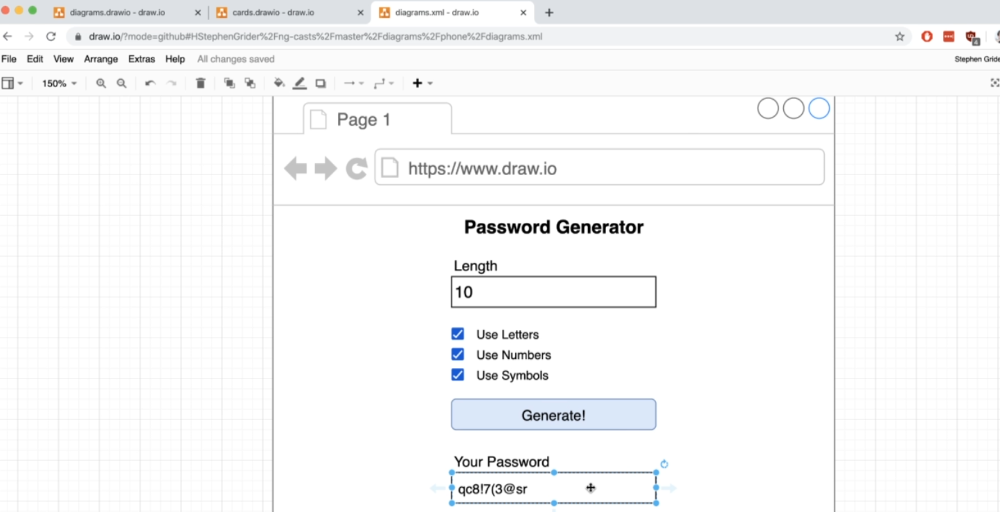  

App generate password

Create new project by command: `ng new name-app`

### 008 Starting and Stopping an Angular Project
### 009 Updating a Component Template
### 010 Event Binding Syntax
### 011 Property Binding Syntax
### 012 Interpolation Syntax
### 013 Angular vs JavaScript Design Patterns

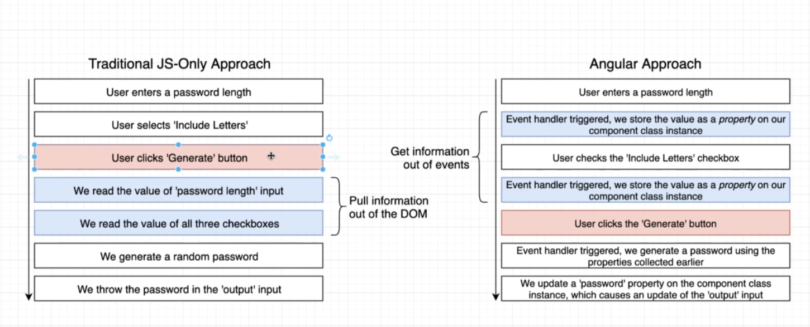  


app.component.html

```html
<h1>Password Generator</h1>

<div>
  <label>Enter Length</label>
  <input (input)="onChangeLength($event.target.value)" />
</div>

<div>
  <label>Use Letters</label>
  <input (change)="onChangeUseLetters()" type="checkbox" />
</div>

<div>
  <label>Use Numbers</label>
  <input (change)="onChangeUseNumbers()" type="checkbox" />
</div>

<div>
  <label>Use Symbols</label>
  <input (change)="onChangeUseSymbols()" type="checkbox" />
</div>

<div>
  <button (click)="onButtonClick()">Generate!</button>
</div>

<div>
  <label>Your Password</label>
  <input [value]="password" />
</div>

```

app.component.ts

```ts
import { Component } from '@angular/core';

@Component({
  selector: 'app-root',
  templateUrl: './app.component.html',
  styleUrls: ['./app.component.css']
})
export class AppComponent {
  length = 0;
  includeLetters = false;
  includeNumbers = false;
  includeSymbols = false;
  password = '';

  onChangeLength(value: string) {
    // nếu là chuỗi thì sau khi parse là NAN
    const parsedValue = parseInt(value);

    if (!isNaN(parsedValue)) {
      this.length = parsedValue;
    }
  }

  onChangeUseLetters() {
    this.includeLetters = !this.includeLetters;
  }

  onChangeUseNumbers() {
    this.includeNumbers = !this.includeNumbers;
  }

  onChangeUseSymbols() {
    this.includeSymbols = !this.includeSymbols;
  }

  onButtonClick() {
    console.log(`
      About to generate a password with the following:
      Includes letters: ${this.includeLetters}
      Includes numbers: ${this.includeNumbers}
      Includes symbols: ${this.includeSymbols}
    `);
    this.password = 'MY PASSWORD!!!';
  }
}

```


### 014 Tracking Input State
### 015 Tracking Additional Properties

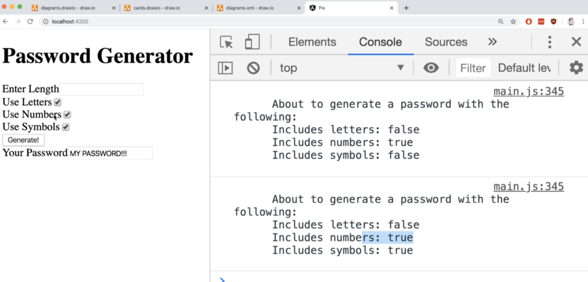

### 017 Generating a Random Password

```ts
onButtonClick() {
    const numbers = '1234567890';
    const letters = 'abcdefghijklmnopqrstuvwyz';
    const symbols = '!@#$%^&*()';

    let validChars = '';
    if (this.includeLetters) {
      validChars += letters;
    }
    if (this.includeNumbers) {
      validChars += numbers;
    }
    if (this.includeSymbols) {
      validChars += symbols;
    }

    let generatedPassword = '';
    for (let i = 0; i < this.length; i++) {
      const index = Math.floor(Math.random() * validChars.length);
      generatedPassword += validChars[index];
    }
    this.password = generatedPassword;
  }
```


### 018 Review on Property Binding

Thêm tt disable

```html
<button
        [disabled]="
          !(length && (includeLetters || includeSymbols || includeNumbers))
        "
        (click)="onButtonClick()"
        class="button is-link is-fullwidth"
      >
        Generate!
      </button>
```


### 019 Adding Third Party CSS

npm install bulma

### 020 CSS Import Statements

file styles.css

```css
/* You can add global styles to this file, and also import other style files */
@import 'bulma/css/bulma.css';

```


### 021 Adding Some Styling

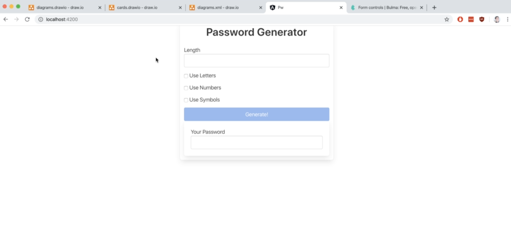  

app.component.html

```html
<div class="container">
  <div class="columns is-centered">
    <div class="box column is-one-third">
      <h1 class="title has-text-centered">Password Generator</h1>

      <div class="field">
        <label>Length</label>
        <input class="input" (input)="onChangeLength($event.target.value)" />
      </div>

      <div class="field">
        <div class="control">
          <label class="checkbox">
            <input (change)="onChangeUseLetters()" type="checkbox" />
            Use Letters
          </label>
        </div>
      </div>

      <div class="field">
        <div class="control">
          <label class="checkbox">
            <input (change)="onChangeUseNumbers()" type="checkbox" />
            Use Numbers
          </label>
        </div>
      </div>

      <div class="field">
        <div class="control">
          <label class="checkbox">
            <input (change)="onChangeUseSymbols()" type="checkbox" />
            Use Symbols
          </label>
        </div>
      </div>

      <button
        [disabled]="
          !(length && (includeLetters || includeSymbols || includeNumbers))
        "
        (click)="onButtonClick()"
        class="button is-link is-fullwidth"
      >
        Generate!
      </button>

      <div class="box" *ngIf="password">
        <label>Your Password</label>
        <input class="input" [value]="password" />
      </div>
    </div>
  </div>
</div>

```

### 022 Structural Directives

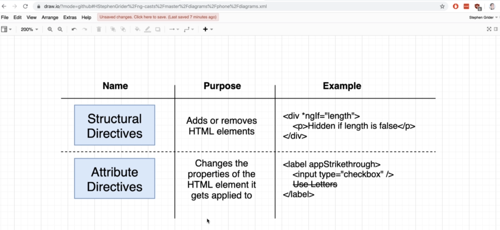

### 023 Deploying Angular Apps

https://vercel.com/

Create new account

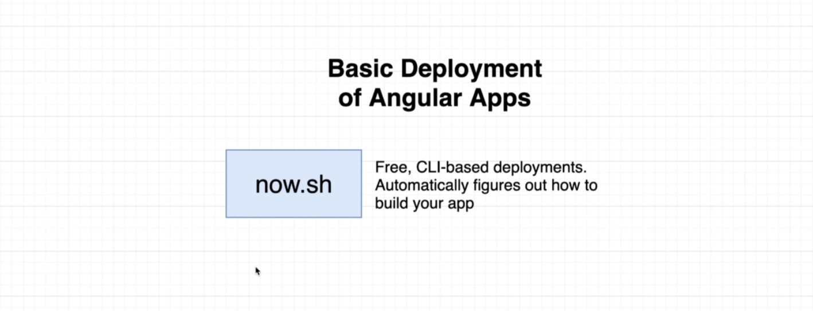  

```shell
npm install --save now
now login

# Sau đó vào email confirm bằng cách click vào nút VERIFY 
now
```

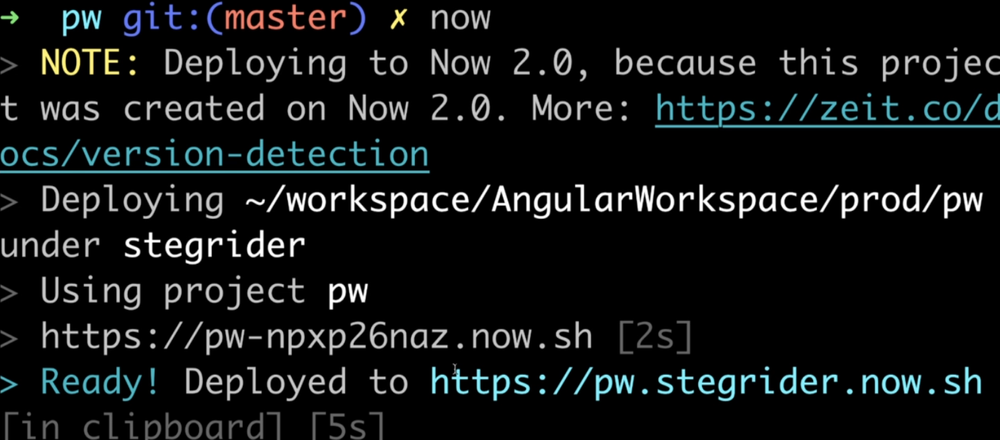

### 024 Terminology Review


### 016 Handling Text Input


## 03 Building Components
### 025 App Overview

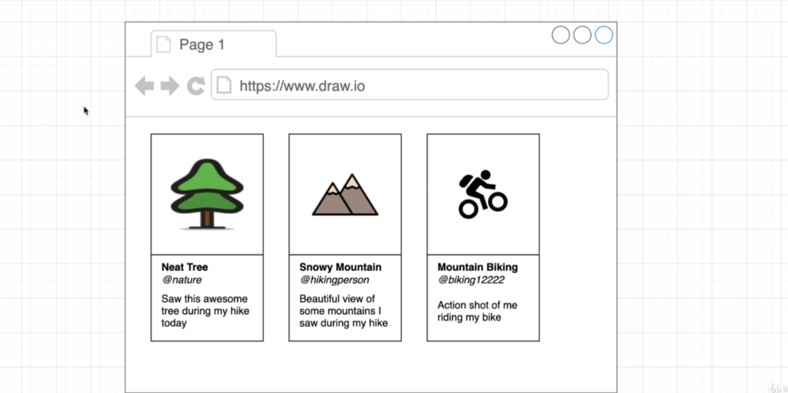

### 026 Project Setup
### 027 A Quick HTML Dump
### 028 Adding Static Files to Angular
### 029 Scoped CSS Files

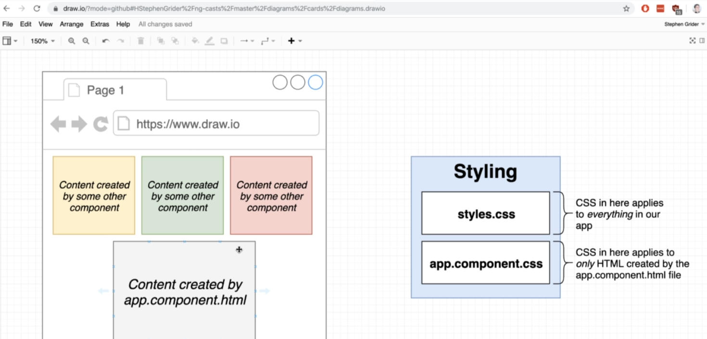

### 030 Components in Angular
### 031 Creating Components

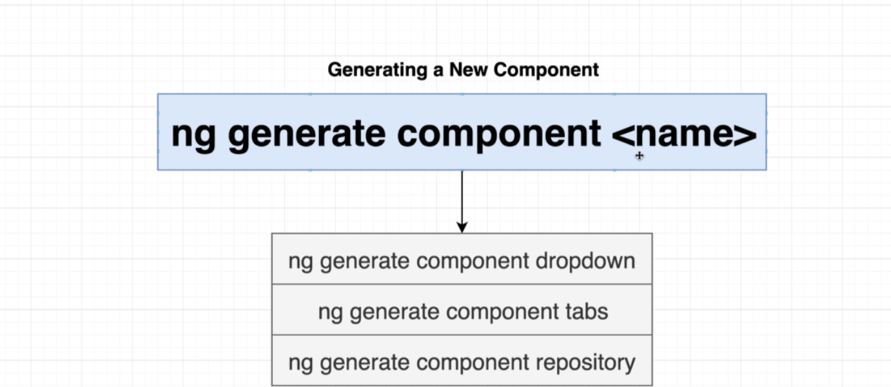  

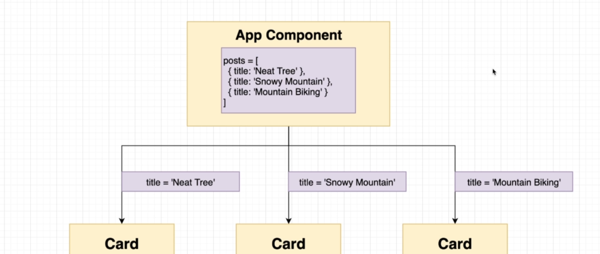  

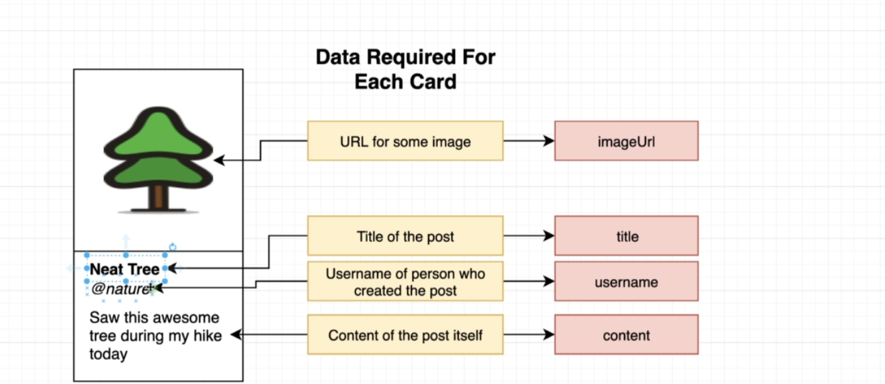

### 032 How Angular Creates Components
### 033 More on CSS Scoping
### 034 Tying Data to a Component

card.component.html

```html
<div class="card">
  <div class="card-image">
    <figure class="image is-4by3">
      
    </figure>
  </div>
  <div class="card-content">
    <div class="media-content">
      <p class="title is-4">{{ title }}</p>
      <p class="subtitle is-6">@{{ username }}</p>
    </div>
    <div class="content">
      {{ content }}
    </div>
  </div>
</div>

```

card.component.ts

```ts
import { Component, OnInit, Input } from '@angular/core';

@Component({
  selector: 'app-card',
  templateUrl: './card.component.html',
  styleUrls: ['./card.component.css']
})
export class CardComponent implements OnInit {
  @Input() title = '';
  @Input() imageUrl = '';
  @Input() content = '';
  @Input() username = '';

  constructor() {}

  ngOnInit() {}
}

```

app.component.html

```html
<app-card
  *ngFor="let post of posts"
  [title]="post.title"
  [imageUrl]="post.imageUrl"
  [username]="post.username"
  [content]="post.content"
>
</app-card>

```


### 036 Communicating from Parent to Child
### 037 Fixing Template References
### 038 Building Lists with NgFor
### 039 Two Notes on NgFor
### 040 Host Element Selectors
### 041 Deployment and Review
### 035 Accepting Data in a Child Component


## 04 Exercise  Building a Typing Game
### 042 App Overview
### 043 Initial Steps
### 044 Adding CSS
### 045 Displaying Content
### 046 Randomly Generating Text
### 047 Handling User Input
### 048 Conditional Display
### 049 Character by Character Comparison
### 050 Styling by Comparison
## 05 Mastering Pipes
### 051 Pipes Overview
### 052 Adding an Input
### 053 Pipes in Action
### 054 A Touch of Styling
### 055 Adding a Date Picker
### 056 Formatting Dates
### 057 Displaying Currency
### 058 Formatting the Currency
### 059 Formatting Numbers
### 060 Displaying JSON
### 061 Creating Custom Pipes
### 062 Custom Arguments
### 063 Two Neat Things with Pipes
## 06 Directives in Angular
### 064 App Overview
### 067 Review on NgFor
### 068 The NgClass Directive
### 069 More on NgClass
### 070 Conditionally Disabling Buttons
### 071 Changes Pages
### 072 Displaying Images
### 073 Reminder on NgIf
### 074 Multiple Directives with Ng-Container
### 075 NgSwitch
### 076 Generating Custom Directives
### 077 Accessing Elements from a Custom Directive
### 078 Communicating Properties to Directives
### 079 Intercepting a Property Assignment
### 080 Input Aliasing
### 082 Custom Structural Directives
### 083 Context in Structural Directives
### 081 Replacing NgClass
### 065 App Setup
### 066 Getting Some Data
## 07 The Module System
### 084 App Overview
### 085 Tackling Some Challenges
### 086 Modules Overview
### 087 Generating Modules
### 088 Importing and Exporting Modules
### 089 Modules Exercise
### 090 Quick Note.html
### 091 Modules Exercise Solution
### 092 Module Property Definitions
## 08 Routing and Navigation Between Pages
### 093 Adding Basic Routing
### 094 Routing Exercise
### 095 Exercise Solution
### 096 The RouterOutlet Element
### 097 Navigating with RouterLink
### 098 A Touch of Styling
### 099 Styling an Active Link
### 100 Adding Home and NotFound Routes
### 101 Reordering Routing Rules
### 102 Landing and NotFound Components
## 09 Lazy Loading with Modules
### 103 Lazy vs Eager Loading
### 104 Implementing Lazy Loading
### 105 Lazy Loading Exercise
### 106 Exercise Solution
### 107 Creating a Placeholder Component
### 108 Customizing Components
### 109 Reminder on Structural Directives
### 110 Widget Modules
### 111 Implementing a Titled Divider
### 112 Grabbing Content with NgContent
### 113 Creating a Segment Component
### 114 NgContent with Selects
### 115 Hiding Empty Elements
### 116 Building a Reusable Table
### 117 Generating and Displaying the Table
### 118 Communicating Down Table Data
### 119 Assembling the Table
### 120 Passing Down Class Names
## 10 Advanced Component Routing
### 121 Tab Based Navigation
### 122 Adding Child Navigation Routes
### 123 Understanding Child Component Routing
### 124 RouterLink Configuration
### 125 Relative RouterLink References
### 126 Alternate RouterLink Syntax
### 127 Matching Exact Paths
### 128 A Reusable Tabs Component
### 129 Views Module Exercise
### 130 Exercise Solution
### 131 Displaying a List of Statistics
### 132 Displaying a List of Items
## 11 Advanced Component Reusability  Hooks
### 133 The Mods Module
### 134 Modal Window Setup
### 135 More Basic Modal Setup
### 136 Natural Issues with Modal Windows
### 137 Solving the Modal Issue
### 138 Lifecycle Hooks
### 139 Hiding the Modal with NgOnDestroy
### 140 Opening the Modal
### 141 Closing the Modal
### 142 Stopping Event Bubbling
### 143 Making the Modal Reusable
### 144 Building an Accordion
### 145 Listing Accordion Elements
### 146 Expanding the Active Element
## 12 A Typescript Overview
### 147 Intro to TypeScript
### 148 Basic Types
### 149 Type Inference
### 150 Why TypeScript at All
### 151 TS with Functions
### 152 Difficulties with Objects
### 153 Introducing Interfaces
### 154 Classes and Properties
### 155 Public and Private
### 156 Property Assignment Shortcut
### 157 Enabling Decorator Support
### 158 Decorators
### 159 The Module System
### 160 Strict Mode
### 161 Combining Interfaces and Classes
### 162 Class Generics
### 163 Function Generics
## 13 Handling Data and HTTP Requests
### 164 App Overview
### 165 App Architecture
### 166 Generating Services
### 168 Handling Form Submission
### 169 Child to Parent Communication
### 170 The Wikipedia API
### 171 Notes on Services
### 172 Accessing Services
### 173 Really  Weird Behavior
### 174 Whered That Come From
### 175 Ok But Why
### 176 Why Dependency Injection is Useful
### 177 Making HTTP Requests
### 178 Seeing the Requests Response
### 179 More Parent to Child Communication
### 180 Building the Table
### 167 Component Design Methodology
## 14 App Security in Angular
### 181 Escaping HTML Characters
### 182 XSS Attacks
### 183 More on XSS Attacks
### 184 Adding Title Links
### 185 Another CSS Gotcha
### 186 Last Bit of Styling
## 15 RxJs From the Fundamentals
### 187 Notes on RxJs
### 188 A Quick JS Example
### 189 Adding RxJs Terminology
### 190 Creating an Observable
### 192 More Processing
### 193 Adding an Observer
### 194 Operator Groups
### 195 Specific Operators
### 196 Low Level Observables
### 197 Alternative Observer Syntax
### 198 Unicast Observables
### 199 More on Unicast Observables
### 200 Multicast Observables
### 201 Multicast in Action
### 202 Hot vs Cold Observables
### 191 Implementing the Processing Pipeline
## 16 Bonus - Typescript  RxJs
### 203 RxJs in an Angular World
### 205 Generics with RxJs
### 206 Using TypeScript to Catch Errors
### 207 TypeScript is Smart
### 208 Summary
### 204 Applying TypeScript to RxJs
## 17 Exercise  A Photo-Fetching App
### 209 App Overview
### 210 App Architecture Design
### 211 API Signup
### 212 HTTP Module Hookup
### 213 HTTP Dependency Injection
### 214 Making the Request
### 216 Making the Request
### 217 Using a Generic Type
### 218 Displaying the Image
### 219 Refetching Data
### 215 Displaying the Component
## 18 Credit Card Payments with Reactive Forms
### 220 App Overview
### 223 Binding a FormGroup to a Form
### 224 Validating Fields
### 225 Finding Validation Errors
### 226 Nasty Error Handling
### 228 Making a Reusable Input
### 229 Adding Message Cases
### 230 Changing Styling on Validation Errors
### 231 Adding Additional Inputs
### 232 Handling Form Submission
### 233 Additional Validations
### 234 Input Masking
### 236 Inserting Extra Characters
### 237 Reformatting the Input
### 238 Using a Library for Masking
### 239 Resetting a Form
### 240 A Touch of Styling
### 241 Adding a Credit Card
### 221 Reactive Forms vs Template Forms
### 222 Creating a Form Instance
### 227 Showing and Hiding Validation Messages
### 235 Hijacking Form Control Values
## 19 Simple Data Entry with Template Forms
### 242 App Overview
### 243 Basic Template Form Setup
### 244 Two Way Binding Syntax
### 245 Differences Between Template and Reactive Forms
### 246 Validation Around Template Forms
### 247 Conditional Validation
### 248 Handling Form Submission
### 249 Adding Styling and Wrapup
## 20 Build a Fast-Paced Math Game
### 250 App Overview
### 251 App Setup
### 252 Possible Design Approaches
### 253 Displaying Form Values
### 254 Adding Custom Validation
### 255 Extracting Custom Validation Logic
### 256 Making Validators Reusable
### 257 RxJs with Reactive Forms
### 258 Handling Correct Answers
### 259 The Delay Operator
### 260 Adding a Statistic
### 261 RxJs Solution
### 262 A Touch of Styling
### 263 Helping the User Along
### 264 Accessing FormGroups from Custom Directives
### 265 Detecting Changes
### 266 Applying a Class Name
## 21 Custom Validators
### 267 App Overview
### 268 The API Server
### 269 Contacting the Backend API
### 270 Cookie Based Authentication
### 271 File Generation
### 272 Navigation Reminder
### 273 Adding a Signup Form
### 274 Adding Basic Styling
### 275 Username and Password Validation
### 276 Writing Custom Validators
### 277 Connecting Custom Validators
### 278 Implementing Async Validators
### 279 Nasty Async Validators
### 280 Understanding Async Validators
### 281 Handling Errors from Async Validation
### 282 Building an Auth Service
### 283 Another Reusable Input
### 284 Robust Error Handling
### 285 Customizing Input Type
### 286 Fixing a Few Odds and Ends
## 22 Handling Authentication
### 287 Signup Process Overview
### 288 Making the Signup Request
### 289 Cleaning up the Auth Service
### 290 Handling Signup Errors
### 291 Generic Error Handling
### 292 Adding a Navigation Header
### 293 Maintaining Authentication State
### 294 Oh No More RxJs
### 295 Using BehaviorSubjects
### 296 The Async Pipe
### 297 Exact Active Links
### 298 Checking Auth Status
### 299 A Gotcha Around the HttpClient
### 300 HTTP Interceptors
### 301 Wiring up an Interceptor
### 302 Modifying Outgoing Requests
### 303 Other Uses of Interceptors
### 304 A Little Record Keeping
### 305 Adding Sign Out
### 306 Automated Signouts
### 307 Programmatic Navigation
### 308 Building the Sign In Flow
### 309 Sign In Authentication
### 310 Showing Authentication Errors
### 311 Inbox Module Design
### 312 Navigation on Authentication
## 23 More on Angular App Security
### 313 Restricting Routing with Guards
### 314 Issues With Guards
### 315 A Solution to the Guard with RxJs
### 316 Implementing Our RxJs Solution
### 317 Navigation on Failing a Guard
## 24 Build a Real Email Client
### 318 Generating Inbox Components
### 319 Retrieving Emails
### 320 Adding Email Fetching to the Service
### 321 Connecting the Service
### 322 Rendering a List of Emails
### 323 Child Route Navigation
### 324 Relative Links with Router Link
### 325 Styling the Selected Email
### 326 Placeholder Markup
### 327 Extracting URL Params
### 328 Accessing Route Information
### 329 Snapshot vs Observable Route Params
### 330 Issues with Nested Subscribes
### 331 Canceling Previous Email Requests
### 332 Handling Undefined Data
### 333 Reusable Data Fetching with Resolvers
### 334 Using a Resolver
### 335 Communicating Data Out of a Resolver
### 336 Error Handling with Resolvers
### 337 Showing Email HTML
### 338 Component Reuse in Email Creation
### 339 A Reusable Modal
### 340 Some More Modal Implementation
### 341 Where to Place the Modal
### 342 Toggling Modal Visibility
### 343 Providing a Form Default Values
### 344 Displaying Email Inputs
### 345 Adding Form Validation
### 346 Displaying Textarea instead of Text Input
### 347 Capturing the Username
### 348 Submitting a New Email
### 349 Sending Original Email
### 350 Replying to Emails
### 351 Formatting Reply Emails
### 352 Sending Replies
### 353 Quick Bug Fix
## 25 TypeScript - A DEEP Dive
### 354 Type Annotations and Inference
### 355 Annotations and Variables
### 356 Object Literal Annotations
### 357 Annotations Around Functions
### 358 Understanding Inference
### 359 The Any Type
### 360 Fixing the Any Type
### 361 Delayed Initialization
### 362 When Inference Doesnt Work
### 363 Annotations Around Functions
### 365 Annotations for Anonymous Functions
### 366 Void and Never
### 367 Destructuring with Annotations
### 368 Annotations and Objects
### 369 Arrays in TypeScript
### 370 Why Typed Arrays
### 371 Multiple Typees in Arrays
### 372 When to Use Typed Arrays
### 374 Tuples in Action
### 375 Why Tuples
### 376 Interfaces
### 377 Long Type Annotations
### 378 Fixing Annotations With Interfaces
### 379 Syntax Around Interfaces
### 380 Functions in Interfaces
### 381 Code Reuse with Interfaces
### 382 General Plan with Interfaces
### 383 Classes
### 384 Basic Inheritance
### 385 Class Method Modifiers
### 386 Fields in Classes
### 387 Fields with Inheritance
### 388 Where to Use Classes
### 389 App Overview
### 390 Parcel in Action
### 391 Project Structure
### 392 Generating Random Data
### 393 Type Definition Files
### 394 Using Type Definition Files
### 395 Export Statements in TypeScript
### 396 Defining a Company
### 397 Adding Google Maps Support
### 398 Google Maps Integration with TypeScript
### 399 Exploring Type Definition Files
### 400 Hiding Functionality
### 401 Why Use Private Modifiers Heres Why
### 402 Adding Markers
### 403 Duplicate Code
### 404 One Possible Solution
### 405 Restricting Access with Interfaces
### 406 Implicit Type Checks
### 407 Showing Popup Windows
### 408 Updating Interface Definitions
### 409 Optional Implements Clauses
### 411 App Overview
### 412 Configuring the TS Compiler
### 413 Concurrently Compilation and Execution
### 414 A Simple Sorting Algorithm
### 415 Sorter Scaffolding
### 416 Sorting Implementation
### 417 Two Huge Issues
### 418 TypeScript is Really Smart
### 419 Type Guards
### 420 Why Is This Bad
### 421 Extracting Key Logic
### 422 Seperating Swapping and Comparison
### 423 The Big Reveal
### 424 Interface Definition
### 425 Sorting Abritrary Collections
### 426 Linked List Implementation
### 427 Just... One... More... Fix
### 428 Integrating the Sort Method
### 429 Issues with Inheritance
### 430 Abstract Classes
### 431 Abstract Classes in Action
### 432 Solving All Our Issues with Abstract Classes
### 433 Interfaces vs Abstract Classes
### 373 Tuples in TypeScript
### 410 App Wrapup
### 364 Inference Around Functions
## 26 A Multi-Feature Landing Page App
### 434 NOTE - Unfinished App.html
### 435 App Overview
### 436 Modules Overview
### 437 Generating Modules
### 438 Module Properties
### 439 Connecting Modules
### 440 Examining the API
### 441 Reading the Users Location
### 442 The Angular Way
### 443 Geolocation in an Observable
### 444 Connecting the Service to a Component
### 445 Transforming Coordinates to Query Params
### 446 SwitchMap vs MergeMap
### 447 But Why SwitchMap
### 448 Making a Request
### 449 Further Processing
### 450 Generics on HTTP Requests
### 451 Filter MergeMap Pluck Operators
### 452 Map and toArray Operators
### 453 Accessing Data in the Template
### 454 Pipes Overview
### 455 Data Pipes
### 456 The Async Pipe
### 458 Styling the Forecast Component
### 459 Reminder on the Share Operator
### 460 How to Structure Services
### 461 Generating the Notification Module
### 462 Notifications Service Design
### 463 Introducing Subjects
### 464 Subject Variations
### 465 More Design on Notifications
### 466 Building a Command Structure
### 467 The Scan Operator
### 468 Scan in the Service
### 469 Fixing a Few Errors
### 470 Replay Subject in Action
### 471 A Preferred Solution
### 472 Displaying Messages
### 473 Automatic Timeout
### 474 Notification Styling
### 475 Clearing Messages
### 476 When to Add Notifications
### 477 Showing Success and Errors
### 478 CatchError and ThrowError
### 479 The Retry Operator
### 480 Service Design
### 481 More on API Pagination
### 482 Service Generation
### 483 Subject Declarations
### 484 Building the HTTP Params
### 485 Applying a Type to the Response
### 486 Calculating Pages Available
### 487 Wrapping the Input Subject
### 488 A Better Interface
### 489 The Article List Component
### 490 Accessing the Data
### 491 Rendering Articles
### 492 Fetching a Page
### 493 Fixing Some Styling
### 494 Creating Custom Pipes
### 495 Custom Pipe Arguments
### 496 The Shared Module Pattern
### 497 Connecting the Paginator
### 498 Paginator Strategy
### 499 Paginator Internals
### 500 Styling the Current Page
### 501 Parent to Child Communication
### 457 Adding Bootstrap
## 27 Bonus
### 502 Bonus.html