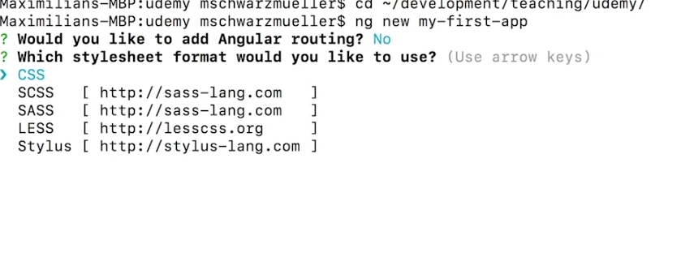
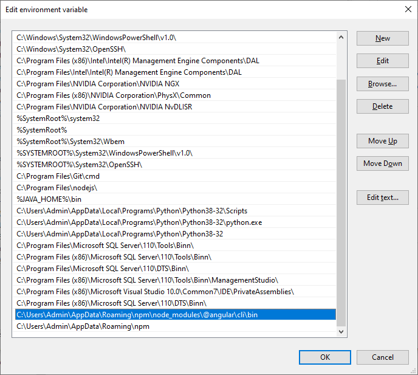
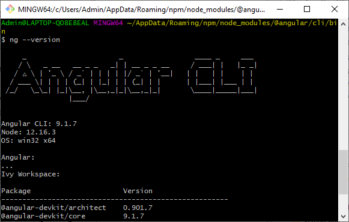
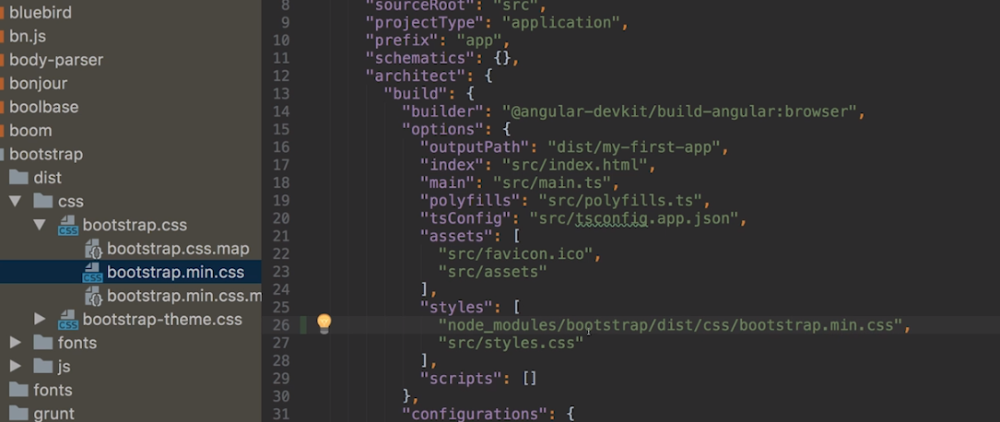
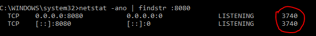
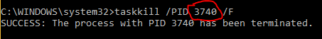

## 1. Project Setup and First App

Node.js Download

At the moment, the Node webpage (nodejs.org) which we're going to use in the next lecture looks different.  

This will only be the case temporarily (as you can tell if you visit the page) but in the meantime, since you're going to need to download NodeJS from the site, here's the download link: https://nodejs.org/en/download/  

We'll need that in the next lecture.

https://angular.io/guide/setup-local  

**To install the Angular CLI**:  
https://github.com/angular/angular-cli/wiki  

```js
node -v
npm -v
npm install -g typescript
npm install -g @angular/clilatest

```

Generating and serving an Angular project via a development server Create and run a new project:

```js
ng new my-project
cd my-project
ng serve

ng serve --port 3000

```

**C:\Users\phuong\AppData\Roaming\npm\node_modules\@angular\cli\bin**
**C:\Users\phuong\AppData\Roaming\npm**

Vào Path thêm rồi restart

```js
npm uninstall -g angular-cli

npm uninstall --save-dev angular-cli

npm cache clean

npm install -g @angular/cli@latest

```

  

I followed below steps for resolution for this issue in Windows 10:

First make sure you have installed Angular CLI . You can use below to install same.
`npm install -g @angular/cli@latest`

**Make sure that AppData is visible and navigate to path below.**
`C:\Users\rkota\AppData\Roaming\npm`

Same path can be found by running below too:

`npm config get prefix`

Add the above path i.e. " C:\Users\rkota\AppData\Roaming\npm" in Environment variable PATH and make sure it got added by running path in command prompt.

Close command prompt and now try to run below:
`ng --version`

you will be able to see CLI version.  

  

  

## 2. A Basic Project Setup using Bootstrap for Styling

```ts
Npm install --save bootstrap@3
```

=>  install locally



Tại file angular.json sửa lại tại options :

```js
	"styles": [
              "node_modules/bootstrap/dist/css/bootstrap.min.css",
              "src/styles.css"
            ],

```

## 3. Kill port

**Run with cmd**

> ```
> netstat -ano | findstr :PORT_NUMBER
> ```

(Replace PORT_NUMBER with the port number you want, but keep the colon)



The area circled in red shows the PID (process identifier). Locate the PID of the process that's using the port you want.

**Step 2:**

Next, run the following command:

> ```
> taskkill /PID Pid /F
> ```

(No colon this time)



### Built-in Validators & Using HTML5 Validation.html

Which Validators do ship with Angular? 

Check out the Validators class: https://angular.io/api/forms/Validators - these are all built-in validators, though that are the methods which actually get executed (and which you later can add when using the reactive approach).

For the template-driven approach, you need the directives. You can find out their names, by searching for "validator" in the official docs: https://angular.io/api?type=directive - everything marked with "D" is a directive and can be added to your template.


