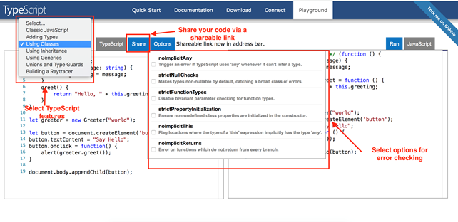

[TOC]


C:\Users\Admin\AppData\Local\Programs\Python\Python38-32\python.exe E:/programing/language/python/python-docs/readfile.py
======== name dir ========
## 1. Introduction
### 1. Introduction
### 2. What is Angular
### 3. Architecture of Angular Apps

There are two file in environments is used for production env và dev env

We have this polyfill file which basically imports some scripts that are required for running angular

because the angler framework uses features of javascript that are not available in the current version

of javascript supported by most browsers out there.

So this poly fills fill the gap between the features of javascript that angular needs and the features

We load out we have Editor config. So if you're working in a team environment you want to make sure that all developers in the team use

the same settings in their editors.

### 4. Setting Up the Development Environment
### 5. Your First Angular App
### 6. Structure of Angular Projects
### 7. Webpack
### 8. Angular Version History
### 9. Angular Basics.html

### 10. Course Structure

  


### 11. Making a Promise

### 12. Asking Questions.html


## 2. TypeScript Fundamentals

### 1. Introduction

https://www.tutorialsteacher.com/typescript/typescript-environment-setup

   


```shell
npm install -g typescript
tsc --version
tsc test.ts
node test.js
```

  


### 2. What is TypeScript

## TypeScript Playground

TypeScript provides an online playground https://www.typescriptlang.org/play to write and test your code on the fly without the need to download or install anything.

This is a great place for beginners just starting to learn TypeScript who want to try different TypeScript features. You also have the option to share your code via a shareable link provided by the playground.

Additionally, you can also select options for error checking your code!

[](https://www.tutorialsteacher.com/Content/images/typescript/ts-playground.png)

### 3. Your First TypeScript Program

### Install TypeScript using Node.js Package Manager

Node.js package manager is used to set up TypeScript on your local environment.

To run TypeScript locally you will need: Node.js, TypeScript, and a code editor of your choice. Learn how to install Node.js in the [install Node.js](https://www.tutorialsteacher.com/nodejs/setup-nodejs-development-environment) chapter.

We will be using Node.js package manager (npm) to install TypeScript. To install or update TypeScript, open command prompt/terminal and type the following command:

```shell
> npm install -g typescript

# Once installed, you can check the TypeScript version using the following command:

> tsc -v
Version 3.9.5
```

Create a new file in your code editor and name it "add.ts". Write the following code in it:

File: add.ts

```ts
function addNumbers(a: number, b: number) { 
    return a + b; 
} 
var sum: number = addNumbers(10,15) 
console.log('Sum of the two numbers is: ' +sum); 
```

### 4. Declaring Variables

### var

Variables in TypeScript can be declared using var keyword, same as in JavaScript. The scoping rules remains the same as in JavaScript.

### let

To solve problems with `var` declarations, ES6 introduced two new types of variable declarations in JavaScript, using the keywords `let` and `const`. TypeScript, being a superset of JavaScript, also supports these new types of variable declarations.

Example: Variable Declaration using let

 Copy

```ts
let employeeName = "John";
// or 
let employeeName:string = "John";
```

The let declarations follow the same syntax as var declarations. Unlike variables declared with `var`, variables declared with `let` have a block-scope. This means that the scope of let variables is limited to their containing block, e.g. function, if else block or loop block. Consider the following example.

Example: let Variables Scope

 Copy

```ts
let num1:number = 1; 
    
function letDeclaration() { 
    let num2:number = 2; 

    if (num2 > num1) { 
        let num3: number = 3;
        num3++; 
    } 

    while(num1 < num2) { 
        let num4: number = 4;
        num1++;
    }

    console.log(num1); //OK
    console.log(num2); //OK 
    console.log(num3); //Compiler Error: Cannot find name 'num3'
    console.log(num4); //Compiler Error: Cannot find name 'num4'
}

letDeclaration();
```

### Advantages of using let over var

**1) Block-scoped let variables cannot be read or written to before they are declared.**

Example: let vs var

 Copy

```ts
console.log(num1); // Compiler Error: error TS2448: Block-scoped variable 'num' used before its declaration
let num1:number = 10 ;

console.log(num2); // OK, Output: undefined 
var num2:number = 10 ;
```

In the above example, the TypeScript compiler will give an error if we use variables before declaring them using let, whereas it won't give an error when using variables before declaring them using var.

**2) Let variables cannot be re-declared**

The TypeScript compiler will give an error when variables with the same name (case sensitive) are declared multiple times in the same block using let.

Example: Multiple Variables with the Same Name

 Copy

```ts
var num:number = 1; // OK
var Num:number = 2;// OK
var NUM:number = 3;// OK
var NuM:number = 4;// OK

let num:number = 5;// Compiler Error: Cannot redeclared block-scoped variable 'num'
let Num:number = 6;// Compiler Error: Cannot redeclared block-scoped variable 'Num'
let NUM:number = 7;// Compiler Error: Cannot redeclared block-scoped variable 'NUM'
let NuM:number = 8;// Compiler Error: Cannot redeclared block-scoped variable 'NuM'
```

In the above example, the TypeScript compiler treats variable names as case sensitive. `num` is different than `Num`, so it won't give any error. However, it will give an error for the variables with the same name and case.

Variables with the same name and case can be declared in different blocks, as shown below.

Example: Same Variable Name in Different Blocks

```ts
let num:number = 1; 

function demo() {
    let num:number = 2;

    if(true) { 
        let num:number = 3;
        console.log(num); //Output: 3
    }

    console.log(num);//Output: 2
}
console.log(num); //Output: 1
demo();
```

Similarly, the compiler will give an error if we declare a variable that was already passed in as an argument to the function, as shown below.

```ts
function letDemo(a: number ) { 
    let a:number = 10 ; //Compiler Error: TS2300: Duplicate identifier 'a'
    let b:number = 20 ; 

    return a + b ;
}
```

Thus, variables declared using `let` minimize the possibilities of runtime errors, as the compiler give compile-time errors. This increases the code readability and maintainability.

### Const

Variables can be declared using const similar to var or let declarations. The const makes a variable a constant where its value **cannot be changed.** Const variables have the same scoping rules as let variables.

Example: Const Variable

```ts
const num:number = 100;
num = 200; //Compiler Error: Cannot assign to 'num' because it is a constant or read-only property
```

Const variables must be declared and initialized in a single statement. Separate declaration and initialization is not supported.

```ts
const num:number; //Compiler Error: const declaration must be initialized
num = 100; 
```

Const variables allow an object sub-properties to be changed but not the object structure.

Example: const Object

```ts
const playerCodes = { 
    player1 : 9, 
    player2 : 10, 
    player3 : 13, 
    player4 : 20
}; 
playerCodes.player2 = 11; // OK

playerCodes = {     //Compiler Error: Cannot assign to playerCodes because it is a constant or read-only
    player1 : 50,   // Modified value
    player2 : 10, 
    player3 : 13, 
    player4 : 20
}; 
```

Even if you try to change the object structure, the compiler will point this error out.

```ts
const playerCodes = { 
    player1: 9, 
    player2: 10, 
    player3: 13, 
    player4: 20
}; 

playerCodes = { //Compiler Error: Cannot assign to playerCodes because it is a constant or read-only
    player1: 9, 
    player2: 10, 
    player3: 13, 
    player4: 20, 
    player5: 22
}; 
```

### 5. Types

  

# TypeScript Data Type - Number

Just like JavaScript, TypeScript supports number data type. All numbers are stored as floating point numbers. These numbers can be Decimal (base 10), Hexadecimal (base 16) or Octal (base 8).

Example: TypeScript Number Type Variables

 Copy

```ts
let first:number = 123; // number 
let second: number = 0x37CF;  // hexadecimal
let third:number=0o377 ;      // octal
let fourth: number = 0b111001;// binary  

console.log(first);  // 123 
console.log(second); // 14287
console.log(third);  // 255
console.log(fourth); // 57 
```

In the above example, `let first:number = 1;` stores a positive integer as a number. `let second: number = 0x37CF;` stores a hexadecimal as a number which is equivalent to 14287. When you print this number on your browser's console, it prints the equivalent floating point of the hexadecimal number. `let third:number=0377;` stores an octal number equivalent to 255.

## Number Methods

| Method                                                       | Description                                                  |
| ------------------------------------------------------------ | ------------------------------------------------------------ |
| [toExponential()](https://www.tutorialsteacher.com/typescript/typescript-number#toexponential) | Returns the exponential notation in string format.           |
| [toFixed()](https://www.tutorialsteacher.com/typescript/typescript-number#tofixed) | Returns the fixed-point notation in string format.           |
| [toLocaleString()](https://www.tutorialsteacher.com/typescript/typescript-number#tolocalestring) | Converts the number into a local specific representation of the number. |
| [toPrecision()](https://www.tutorialsteacher.com/typescript/typescript-number#toprecision) | Returns the string representation in exponential or fixed-point to the specified precision. |
| [toString()](https://www.tutorialsteacher.com/typescript/typescript-number#tostring) | Returns the string representation of the number in the specified base. |
| [valueOf()](https://www.tutorialsteacher.com/typescript/typescript-number#valueof) | Returns the primitive value of the number.                   |

## toExponential()

The toExponential method returns the exponential notation of a number in string format, based on the specified fraction digits.

Signature:

```
numObj.toExponential([fractionDigits])
```

This function takes in one argument, an optional integer specifying the number of digits after the decimal point. It returns the exponential representation of the number in a string format.

Example: toExponential()

 Copy

```ts
let myNumber: number = 123456;

myNumber.toExponential(); // returns 1.23456e+5
myNumber.toExponential(1); //returns 1.2e+5
myNumber.toExponential(2); //returns 1.23e+5
myNumber.toExponential(3); //returns 1.235e+5
```

## toFixed()

The toFixed method returns the fixed-point notation of a number in string format.

Signature:

```
numObj.toFixed([digits])
```

This function has one optional argument, an integer specifying the number of digits after the decimal point. It returns a string representation of the formatted number.

Example: toFixed()

 Copy

```ts
let myNumber: number = 10.8788;

myNumber.toFixed(); // returns 11
myNumber.toFixed(1); //returns 10.9
myNumber.toFixed(2); //returns 10.88
myNumber.toFixed(3); //returns 10.879
myNumber.toFixed(4); //returns 10.8788
```

## toLocaleString()

The toLocaleString method converts the number into a local specific representation of the number.

Signature:

```
numObj.toLocaleString([locales [, options]])
```

This function takes in two arguments: the locale, and an optional options argument representing the locale to which you would like to get the equivalent number representation. In the below example, we pass the string 'de-DE' which is the locale for German.

Example: toLocaleString()

 Copy

```ts
let myNumber: number = 10667.987;

myNumber.toLocaleString(); // returns 10,667.987 - US English
myNumber.toLocaleString('de-DE'); // returns 10.667,987 - German
myNumber.toLocaleString('ar-EG'); // returns 10667.987 in Arebic
```

## toPrecision()

The toPrecision method returns the string representation in exponential or fixed-point to the specified precision.

Signature:

```
numObj.toPrecision([precision])
```

This function takes in one optional argument, a number representing the precision i.e. the number of significant digits. It returns a string representation to the specified precision.

Example: toPrecision()

 Copy

```ts
let myNumber: number = 10.5679;

myNumber.toPrecision(1); // returns 1e+1
myNumber.toPrecision(2); // returns 11
myNumber.toPrecision(3); // returns 10.6
myNumber.toPrecision(4); // returns 10.57
```

## toString()

The toString method returns a string representation of the number in the specified base.

Signature:

```
numObj.toString([radix])
```

This function takes in one optional argument, a radix number representing the base for which a string representation is to be returned. The radix value should be between 2 and 36.

Example: toString()

 Copy

```ts
let myNumber: number = 123;
myNumber.toString(); // returns '123'
myNumber.toString(2); // returns '1111011'
myNumber.toString(4); // returns '1323'
myNumber.toString(8); // returns '173'
myNumber.toString(16); // returns '7b'
myNumber.toString(36); // returns '3f'
```

## valueOf()

The valueOf method returns the primitive value of the number.

Signature:

```
numObj.valueOf()
```

This function returns the primitive value of the Object being called on.

Example: valueOf()

 Copy

```ts
let myNumber = new Number(123);
console.log(myNumber) //Output: a number object with value 123
console.log(myNumber.valueOf()) //Output: 123
console.log(typeof num) //Output: object

let num2 = num.valueOf() 
console.log(num2) //Output: 123
console.log(typeof num2) //Output: number
```

#   TypeScript - String

String is another primitive data type that is used to store text data. String values are surrounded by single quotation marks or double quotation marks.

Example: TypeScript String Type Variable

 Copy

```ts
let employeeName:string = 'John Smith'; 
//OR
let employeeName:string = "John Smith"; 
```

## Template String

Since TypeScript version 1.4, TypeScript has included support for ES6 Template strings. Template strings are used to embed expressions into strings.

Example: Template String Pre-ES6

 Copy

```ts
let employeeName:string = "John Smith"; 
let employeeDept:string = "Finance"; 

// Pre-ES6 
let employeeDesc1: string = employeeName + " works in the " + employeeDept + " department."; 

// Post-ES6 
let employeeDesc2: string = `${employeeName} works in the ${employeeDept} department.`; 

console.log(employeeDesc1);//John Smith works in the Finance department. 
console.log(employeeDesc2);//John Smith works in the Finance department. 
```

Here, instead of writing a string that is a combination of text and variables with concatenations, we can use a single statement with back-ticks ```. The variable values are written as `${}`. Using template strings, it is easier to embed expressions and also less tedious to write long text-based strings.

## String methods

| Method                                                       | Description                                                  |
| ------------------------------------------------------------ | ------------------------------------------------------------ |
| [charAt()](https://www.tutorialsteacher.com/typescript/typescript-string#charat) | Returns the character at the given index                     |
| [concat()](https://www.tutorialsteacher.com/typescript/typescript-string#concat) | Returns a combination of the two or more specified strings   |
| [indexOf()](https://www.tutorialsteacher.com/typescript/typescript-string#indexof) | Returns an index of first occurrence of the specified substring from a string (-1 if not found) |
| [replace()](https://www.tutorialsteacher.com/typescript/typescript-string#replace) | Replaces the matched substring with a new substring          |
| [split()](https://www.tutorialsteacher.com/typescript/typescript-string#split) | Splits the string into substrings and returns an array       |
| [toUpperCase()](https://www.tutorialsteacher.com/typescript/typescript-string#touppercase) | Converts all the characters of the string into upper case    |
| [toLowerCase()](https://www.tutorialsteacher.com/typescript/typescript-string#tolowercase) | Converts all the characters of the string into lower case    |
| charCodeAt()                                                 | Returns a number that is the UTF-16 code unit value at the given index |
| codePointAt()                                                | Returns a nonnegative integer Number that is the code point value of the UTF-16 encoded code point starting at the specified index |
| includes()                                                   | Checks whether a string includes another string              |
| endsWith()                                                   | Checks whether a string ends with another string             |
| LastIndexOf()                                                | Returns the index of last occurrence of value in the string  |
| localeCompare()                                              | Checks whether a string comes before, after or is the same as the given string |
| match()                                                      | Matches a regular expression against the given string        |
| normalize()                                                  | Returns the Unicode Normalization Form of the given string.  |
| padEnd()                                                     | Pads the end of the current string with the given string     |
| padStart()                                                   | Pads the beginning of the current string with given string   |
| repeat()                                                     | Returns a string consisting of the elements of the object repeated in the given times. |
| search()                                                     | Searches for a match between a regular expression and a string |
| slice()                                                      | Returns a section of a string                                |
| startsWith()                                                 | Checks whether a string starts with another string           |
| substr()                                                     | Returns a string beginning at the specified location and of the given characters |
| substring()                                                  | Returns a string between the two given indexes               |
| toLocaleLowerCase()                                          | Returns a lower case string while respecting current locale  |
| toLocaleUpperCase()                                          | Returns an upper case string while respecting current locale |
| trim()                                                       | Trims the white space from beginning and end of string       |
| trimLeft()                                                   | Trims the white space from left side of the string           |
| trimRight()                                                  | Trims the white space from right side of the string          |

## charAt()

The charAt() method returns a character at the specified index from a string.

Signature:

```
character = str.charAt(index)
```

This method takes one number argument index and returns the character at the given index in the string.

Example: charAt()

 Copy

```ts
let str: string = 'Hello TypeScript';
str.charAt(0); // returns 'H'
str.charAt(2); // returns 'l'
"Hello World".charAt(2); returns 'l'
```

## concat()

The concat() method concatenates two or more specified strings.

Signature:

```
str.concat(string2[, string3, ..., stringN])
```

This method takes two or more arguments of strings and returns a concatenation of the given strings.

Example: concat()

 Copy

```ts
let str1: string = 'Hello';
let str2: string = 'TypeScript';
str1.concat(str2); // returns 'HelloTypeScript'
str1.concat(' ', str2); // returns 'Hello TypeScript'
str1.concat(' Mr. ', 'Bond'); // returns 'Hello Mr. Bond'
```

## indexOf()

The indexOf() method returns an index of first occurrence of the specified sub string from a string. The index starts from 0. It returns -1 if not found. the indexOf() method search is case-sensitive, so 't' and 'T' are different.

Optionally, you can specify an index as a second parameter to define where the searching should start from.

Signature:

```
str.indexOf(searchValue[, fromIndex])
```

This method takes two arguments, the search string and an optional index number denoting the location the searching should start.

Example: indexOf()

 Copy

```ts
let str: string = 'TypeScript';

str.indexOf('T'); // returns 0
str.indexOf('p'); // returns 2
str.indexOf('e'); // returns 3
str.indexOf('T', 1); // returns -1
str.indexOf('t', 1); // returns 9
```

## replace()

The replace() method replaces the matched substring with the specified string. The regular expression can also be used for searching.

Signature:

```
str.replace(regexp|substr, newSubstr|function)
```

This method takes two arguments: a regex of string to be found, and the new string that will replace the existing substring.

Example: replace()

 Copy

```ts
let str1: string = 'Hello Javascript';
let str2: string = 'TypeScript';

str1.replace('Java', 'Type'); // returns 'Hello TypeScript'
str1.replace('JavaScript', str2); // returns 'Hello TypeScript'
str1.replace(/Hello/gi, 'Hi'); // returns 'Hi TypeScript'
```

## split()

The split() method splits a string into substrings based on a specified separator character and returns an array of substrings.

Signature:

```
str.split([separator[, limit]])
```

This method takes two arguments: a separator string and an optional limit specifying the number of entries to be found.

Example: split()

 Copy

```ts
let str1: string = 'Apple, Banana, Orange';
let str2: string = ',';

str1.split(str2) // returns [ 'Apple', ' Banana', ' Orange' ]
str1.split(',') // returns [ 'Apple', ' Banana', ' Orange' ]
str1.split(',', 2) // returns [ 'Apple', ' Banana' ]
str1.split(',', 1) // returns [ 'Apple']
```

## toUpperCase()

The toUpperCase() method returns an upper case representation of the string it is called on.

Example: toUpperCase()

 Copy

```ts
let str: string = 'Hello Typescript';
str.toUpperCase(); // returns 'HELLO TYPESCRIPT'
'hello typescript'.toUpperCase(); // returns 'HELLO TYPESCRIPT'
```

## toLowerCase()

The toLowerCase() method returns a lower case representation of the string it is called on.

Example: toLowerCase()

 Copy

```ts
let str: string = 'Hello Typescript';
str.toLowerCase(); // returns hello typescript
'HELLO TYPESCRIPT'.toLowerCase(); // returns hello typescript
```

# TypeScript Data Type - Boolean

Boolean values are supported by both JavaScript and TypeScript and stored as true/false values.

TypeScript Boolean:

```
let isPresent:boolean = true;
```

Note that, Boolean with an upper case B is different from boolean with a lower case b. Upper case Boolean is an object type whereas lower case boolean is a primitive type. It is always recommended to use boolean, the primitive type in your programs. This is because, while JavaScript coerces an object to its primitive type, the TypeScript type system does not. TypeScript treats it like an object type.

So, instead of writing `function checkExistence(b: Boolean)` it is recommended to use `function checkExistence(b: boolean)`.

# TypeScript - Arrays

An array is a special type of data type which can store multiple values of different data types sequentially using a special syntax.

TypeScript supports arrays, similar to JavaScript. There are two ways to declare an array:

**\1. Using square brackets. This method is similar to how you would declare arrays in JavaScript.**

```
let fruits: string[] = ['Apple', 'Orange', 'Banana'];
```

**\2. Using a generic array type, Array<elementType>.**

```
let fruits: Array<string> = ['Apple', 'Orange', 'Banana'];
```

Both methods produce the same output.

Of course, you can always initialize an array like shown below, but you will not get the advantage of TypeScript's type system.

```
let arr = [1, 3, 'Apple', 'Orange', 'Banana', true, false];
```

Arrays can contain elements of any data type, numbers, strings, or even objects.

Arrays can be declared and initialized separately.

Example: Array Declaration and Initialization

```js
let fruits: Array<string>;
fruits = ['Apple', 'Orange', 'Banana']; 

let ids: Array<number>;
ids = [23, 34, 100, 124, 44]; 
```

An array in TypeScript can contain elements of different data types using a generic array type syntax, as shown below.

Example: Multi Type Array

```js
let values: (string | number)[] = ['Apple', 2, 'Orange', 3, 4, 'Banana']; 
// or 
let values: Array<string | number> = ['Apple', 2, 'Orange', 3, 4, 'Banana']; 
```

## Accessing Array Elements:

The array elements can be accessed using the index of an element e.g. `ArrayName[index]`. The array index starts from zero, so the index of the first element is zero, the index of the second element is one and so on.

Example: Access Array Elements

```ts
let fruits: string[] = ['Apple', 'Orange', 'Banana']; 
fruits[0]; // returns Apple
fruits[1]; // returns Orange
fruits[2]; // returns Banana
fruits[3]; // returns undefined
```

Use the for loop to access array elements as shown below.

Example: Access Array Elements using Loop

```ts
let fruits: string[] = ['Apple', 'Orange', 'Banana']; 

for(var index in fruits)
{ 
    console.log(fruits[index]);  // output: Apple Orange Banana
}

for(var i = 0; i < fruits.length; i++)
{ 
    console.log(fruits[i]); // output: Apple Orange Banana
}
```

## Array Methods

The following table lists all Array methods which can be used for different purposes.

| Method           | Description                                                  |
| ---------------- | ------------------------------------------------------------ |
| pop()            | Removes the last element of the array and return that element |
| push()           | Adds new elements to the array and returns the new array length |
| sort()           | Sorts all the elements of the array                          |
| concat()         | Joins two arrays and returns the combined result             |
| indexOf()        | Returns the index of the first match of a value in the array (-1 if not found) |
| copyWithin()     | Copies a sequence of elements within the array               |
| fill()           | Fills the array with a static value from the provided start index to the end index |
| shift()          | Removes and returns the first element of the array           |
| splice()         | Adds or removes elements from the array                      |
| unshift()        | Adds one or more elements to the beginning of the array      |
| includes()       | Checks whether the array contains a certain element          |
| join()           | Joins all elements of the array into a string                |
| lastIndexOf()    | Returns the last index of an element in the array            |
| slice()          | Extracts a section of the array and returns the new array    |
| toString()       | Returns a string representation of the array                 |
| toLocaleString() | Returns a localized string representing the array            |

The following example demonstrates some of the array methods.

Example: Array Methods

 Copy

```ts
var fruits: Array<string> = ['Apple', 'Orange', 'Banana']; 
fruits.sort(); 
console.log(fruits); //output: [ 'Apple', 'Banana', 'Orange' ]

console.log(fruits.pop()); //output: Orange

fruits.push('Papaya'); 
console.log(fruits); //output: ['Apple', 'Banana', 'Papaya']

fruits = fruits.concat(['Fig', 'Mango']); 
console.log(fruits); //output: ['Apple', 'Banana', 'Papaya', 'Fig', 'Mango'] 

console.log(fruits.indexOf('Papaya'));//output: 2
```

# TypeScript - Tuples

TypeScript introduced a new data type called Tuple. Tuple can contain two values of different data types.

Consider the following example of number, string and tuple type variables.

Example: Tuple vs Other Data Types

```ts
var empId: number = 1;
var empName: string = "Steve";        

// Tuple type variable 
var employee: [number, string] = [1, "Steve"];
```

In the above example, we have defined a variable `empId` as number type and `empName` as string type with values. Here, we declared and assigned two variables to id and name of an employee. The same thing can be achieved by using a single tuple type variable. `employee` is the tuple type variable with two values of number and string type. Thus, removing the need to declare two different variables.

A tuple type variable can include multiple data types as shown below.

Example: Tuple

```ts
var employee: [number, string] = [1, "Steve"];
var person: [number, string, boolean] = [1, "Steve", true];

var user: [number, string, boolean, number, string];// declare tuple variable
user = [1, "Steve", true, 20, "Admin"];// initialize tuple variable
```

You can declare an array of tuple also.

Example: Tuple Array

```ts
var employee: [number, string][];
employee = [[1, "Steve"], [2, "Bill"], [3, "Jeff"]];
```

TypeScript generates an array in JavaScript for the tuple variable. For example, `var employee: [number, string] = [1, 'Steve']` will be compiled as `var employee = [1, "Steve"]` in JavaScript.

## Accessing Tuple Elements

We can access tuple elements using index, the same way as an array. An index starts from zero.

Example: Accessing Tuple

 Copy

```ts
var employee: [number, string] = [1, "Steve"];
employee[0]; // returns 1
employee[1]; // returns "Steve"
```

## Add Elements into Tuple

You can add new elements to a tuple using the push() method.

Example: push()

 Copy

```ts
var employee: [number, string] = [1, "Steve"];
employee.push(2, "Bill"); 
console.log(employee); //Output: [1, 'Steve', 2, 'Bill']
```

This is allowed because we are adding number and string values to the tuple and they are valid for the `employee` tuple.

Now, let's try to add a boolean value to the tuple.

```
employee.push(true) 
```

The above example will throw the following error:

```ts
test.ts(4,15): error TS2345: 
Argument of type 'true' is not assignable to parameter of type 'number | string'.
```

We get an error saying that adding a boolean value to a tuple of type 'number | string' is not permitted. Hence, a tuple declared as 'number | string' can store only number and string values.

The tuple is like an array. So, we can use [array methods](https://www.tutorialsteacher.com/typescript/typescript-array#array-methods) on tuple such as pop(), concat() etc.

Example: Use Array Methods

 Copy

```ts
var employee: [number, string] = [1, "Steve"];

// retrieving value by index and performing an operation 
employee[1] = employee[1].concat(" Jobs"); 
console.log(employee); //Output: [1, 'Steve Jobs']
```


### 6. Type Assertions

 

Type assertion allows you to set the type of a value and tell the compiler not to infer it.

https://www.tutorialsteacher.com/typescript/type-assertion  

### 7. Arrow Functions


```ts
let sum = (x: number, y: number): number => {
    return x + y;
}

sum(10, 20); //returns 30
```

### 8. Interfaces


### 9. Classes

```ts
class Employee {
    empCode: number;
    empName: string;

    constructor(code?: number, name?: string) {
            this.empName = name;
            this.empCode = code;
    }

    getSalary() : number {
        return 10000;
    }
}
```

? is optional

### 10. Objects

### 11. Constructors
### 12. Access Modifiers
### 13. Access Modifiers in Constructor Parameters

  


### 14. Properties

TypeScript uses getter/setter syntax that is like ActionScript3.

```js
class foo {
    private _bar: boolean = false;
    get bar(): boolean {
        return this._bar;
    }
    set bar(value: boolean) {
        this._bar = value;
    }
}

// Vì nếu giả sử có biến là x nếu k có _ thì get X() nó mới hiểu được
```

### 15. Modules

like.component.ts

```ts

export class LikeComponent { 
    constructor(private _likesCount: number, private _isSelected: boolean) {
    }

    onClick() {
        this._likesCount += (this._isSelected) ? -1 : +1;
        this._isSelected = !this._isSelected;
    }

    get likesCount() { 
        return this._likesCount;
    }

    get isSelected() {
        return this._isSelected;
    }
}
```

main.ts

```ts

import { LikeComponent } from './like.component';

let component = new LikeComponent(10, true);
component.onClick();
console.log(`likesCount: ${component.likesCount}, isSelected: ${component.isSelected}`);
```


### 16. Exercise.html
### 17. Solution
### 18. A Problem with the Current Implementation

## Method Overriding

When a child class defines its own implementation of a method from the parent class, it is called method overriding.

Example: Method Overriding

 Copy

```ts
class Car {
    name: string;
        
    constructor(name?: string) {
        this.name = name;
    }
    
    run(speed:number = 0) {
        console.log("A " + this.name + " is moving at " + speed + " mph!");
    }
}

class Mercedes extends Car {
    
    constructor(name: string) {
        super(name);
    }
    
    run(speed = 150) {
        console.log('A Mercedes started')
        super.run(speed);
    }
}

class Honda extends Car {
    
    constructor(name: string) {
        super(name);
    }
    
    run(speed = 100) {
        console.log('A Honda started')
        super.run(speed);
    }
}

let mercObj = new Mercedes("Mercedes-Benz GLA");
let hondaObj = new Honda("Honda City")

mercObj.run();  // A Mercedes started A Mercedes-Benz GLA is moving at 150 mph!
hondaObj.run(); // A Honda started A Honda City is moving at 100 mph!
```


## 3. Angular Fundamentals
### 1. Introduction
### 2. Building Blocks of Angular Apps
### 3. Components

```shell
ng g c course
ng g s email
```


### 4. Generating Components Using Angular CLI
### 5. Templates
### 6. Directives
### 7. Services
### 8. Dependency Injection
### 9. Generating Services Using Angular CLI

### 10. List of Authors.html

## 4. Displaying Data and Handling Events
### 1. Introduction
### 10. Two-way Binding
### 11. Pipes
### 12. Custom Pipes
### 13. Favorite Component.html
### 14. Title Casing.html
### 2. Property Binding
### 3. Attribute Binding
### 4. Adding Bootstrap
### 5. Class Binding
### 6. Style Binding
### 7. Event Binding
### 8. Event Filtering
### 9. Template Variables
## 5. Building Re-usable Components
### 1. Introduction
### 10. View Encapsulation
### 11. ngContent
### 12. ngContainer
### 13. Like Component.html
### 2. Component API
### 3. Input Properties
### 4. Aliasing Input Properties
### 5. Output Properties
### 6. Passing Event Data
### 7. Aliasing Output Properties
### 8. Templates
### 9. Styles
## 6. Directives
### 1. Introduction
### 10. ngStyle
### 11. Safe Traversal Operator
### 12. Creating Custom Directives
### 13. Exercise ZippyComponent.html
### 2. ngIf
### 3. Hidden Property
### 4. ngSwitchCase
### 5. ngFor
### 6. ngFor and Change Detection
### 7. ngFor and Trackby
### 8. The Leading Asterisk
### 9. ngClass
## 7. Template-driven Forms
### 1. Introduction
### 10. ngModelGroup
### 11. Control Classes and Directives
### 12. Disabling the Submit Button
### 13. Working with Check Boxes
### 14. Working with Drop-down Lists
### 15. Working with Radio Buttons
### 16. Course Form.html
### 2. Building a Bootstrap Form
### 3. Types of Forms
### 4. ngModel
### 5. Adding Validation
### 6. Specific Validation Errors
### 7. Styling Invalid Input Fields
### 8. Cleaner Templates
### 9. ngForm
## 8. Reactive Forms
### 1. Introduction
### 10. Validating the Form Input Upon Submit
### 11. Nested FormGroups
### 12. FormArray
### 13. FormBuilder
### 14. Quick Recap
### 15. Change Password Form.html
### 2. Building a Bootstrap Form
### 3. Creating Controls Programmatically
### 4. Adding Validation
### 5. Specific Validation Errors
### 6. Implementing Custom Validation
### 7. Asynchronous Operations
### 8. Asynchronous Validators
### 9. Showing a Loader Image
## 9. Consuming HTTP Services
### 1. Introduction
### 10. Handling Errors
### 11. Handling Unexpected Errors
### 12. Handling Expected Errors
### 13. Throwing Application-specific Errors
### 14. Handling Bad Request Errors
### 15. Importing Observable Operators and Factory Methods
### 16. Global Error Handling
### 17. Extracting a Reusable Error Handling Method
### 18. Extracting a Reusable Data Service
### 19. The Map Operator
### 2. JSONPlaceHolder
### 20. Optimistic vs Pessimistic Updates
### 21. Observables vs Promises
### 22. GitHub Followers Page.html
### 3. Getting Data
### 4. Creating Data
### 5. Updating Data
### 6. Deleting Data
### 7. OnInit Interface
### 8. Separation of Concerns
### 9. Extracting a Service


## 10. Routing and Navigation

### 1. Introduction

### 10. Query Parameters

### 11. Subscribing to Multiple Observables

### 12. The SwitchMap Operator

### 13. Programmatic Navigation

### 14. Blog Archives.html

### 2. Routing in a Nutshell

### 3. Configuring Routes

### 4. RouterOutlet

### 5. RouterLink

### 6. RouterLinkActive

### 7. Getting the Route Parameters

### 8. Why Route Parameters Are Observables

### 9. Routes with Multiple Parameters

## 11. Authentication and Authorization

### 1. Introduction

### 10. Getting the Current User

### 11. CanActivate Interface

### 12. Redirecting Users After Logging In

### 13. Protecting Routes Based on the User's Role

### 14. Accessing Protected API Resources

### 15. Quick Recap

### 2. Application Overview

### 3. Architecture

### 4. JSON Web Tokens

### 5. Starter Code

### 6. Implementing Login

### 7. Implementing Logout

### 8. Showing or Hiding Elements

### 9. Showing or Hiding Elements based on the User's Role

## 12. Deployment

### 1. Introduction

### 10. Other Deployment Options

### 11. Deploying to GitHub Pages

### 12. Deploying to Firebase

### 13. Heroku

### 14. Deploying to Heroku

### 15. Engines

### 16. Exercise

### 2. Preparing for Deployment

### 3. JIT vs AOT Compilation

### 4. Angular Compiler in Action

### 5. Building Applications with Angular CLI

### 6. Environments

### 7. Adding Custom Environments

### 8. Linting with Angular CLI

### 9. Linting in VSCode

## 13. Building Real-time Server-less Apps with Firebase

### 1. Introduction

### 10. Async Pipe

### 11. Reading an Object

### 12. As Keyword

### 13. Adding an Object

### 14. Updating an Object

### 15. Removing an Object

### 16. Additional Resources

### 2. What is Firebase

### 3. Your First Firebase Project

### 4. Working with Firebase Databases

### 5. Installing Firebase

### 6. Reading Lists

### 7. A Real-time Database

### 8. Observables and Memory Leaks

### 9. Unsubscribing from Subscriptions

## 14. Animations

### 1. Introduction

### 10. Animatable Properties.html

### 11. Creating Reusable Triggers

### 12. Build a re-usable slide animation.html

### 13. Easings

### 14. Keyframes

### 15. Creating Reusable Animations with animation()

### 16. Parameterizing Reusable Animations

### 17. Animation Callbacks

### 18. Querying Child Elements with query()

### 19. Animating Child Elements with animateChild()

### 2. Examples of Animations

### 20. Running Parallel Animations with group()

### 21. Staggering Animations with stagger()

### 22. Working with Custom States

### 23. Multi-step Animations

### 24. Separation of Concerns

### 3. Different Ways to Create Animations

### 4. Angular Animations

### 5. Importing the Animations Module and Polyfills

### 6. Implementing a Fade-in Animation

### 7. Implementing a Fade-out Animation

### 8. States

### 9. Transitions

## 15. Angular Material 2

### 1. Introduction

### 10. Icons

### 11. Buttons

### 12. Chips

### 13. Progress Spinners

### 14. Tooltips

### 15. Tabs

### 16. Dialogs

### 17. Passing Data to Dialogs

### 18. Other Components.html

### 19. Creating a Reusable Module

### 2. What is Angular Material

### 20. Themes

### 21. SASS

### 22. Creating a Custom Theme

### 23. Using Angular Material's Typography

### 24. Customizing Typography

### 25. An Important Note.html

### 3. Installing Angular Material

### 4. Check Boxes

### 5. Radio Buttons

### 6. Selects

### 7. Inputs

### 8. Text Areas

### 9. Date Pickers

## 16. Redux

### 1. Introduction

### 10. Exercise

### 10.3 Redux Exercise.pdf.pdf

### 11. Redux DevTools

### 12. Calling Backend APIs

### 13. Refactoring Fat Case Statements

### 14. Dealing with Complex Domains

### 2. What is Redux

### 3. Building Blocks of Redux

### 4. Pure Functions

### 5. Installing Redux

### 6. Working with Actions

### 7. The Select Decorator

### 8. Avoiding State Mutation

### 9. Using Immutable.js

## 17. Unit Testing

### 1. Introduction

### 10. Interaction Testing

### 11. Working with Confirmation Boxes

### 12. Limitations of Unit Tests

### 13. Code Coverage

### 14. Exercises.html

### 2. What is Automated Testing

### 3. Types of Tests

### 4. Unit Testing Fundamentals

### 5. Working with Strings and Arrays

### 6. Set Up and Tear Down

### 7. Working with Forms

### 8. Working with Event Emitters

### 9. Working with Spies

## 18. Integration Testing

### 1. Introduction

### 10. Dealing with Route Params

### 11. Testing RouterOutlet Components

### 12. Shallow Component Tests

### 13. Testing Attribute Directives

### 14. Dealing with Asynchronous Operations

### 2. The Setup

### 3. Generating the Setup Code

### 4. Testing Property Bindings

### 5. Testing Event Bindings

### 6. Providing Dependencies

### 7. Getting the Dependencies

### 8. Providing Stubs

### 9. Testing the Navigation

## 19. Project Getting Started

### 1. Introduction

### 10. Fixing a Few Minor Issues

### 11. Deployment

### 2. Challenge

### 3. Accessing the Source Code.html

### 4. Creating a New Project

### 5. Installing Bootstrap 4

### 6. Extracting NavBar Component

### 7. Defining the Routes

### 8. Adding a Drop-down Menu

### 9. Cleaning Up the NavBar


## 20. Project Authentication and Authorization

### 1. Introduction

### 10. Defining Admins

### 11. Protecting the Admin Routes

### 12. Showing or Hiding the Admin Links

### 13. Fixing a Bug

### 2. Implementing Google Login

### 3. Implementing the Logout

### 4. Displaying the Current User

### 5. Using the Async Pipe

### 6. Extracting a Service

### 7. Protecting the Routes

### 8. Redirecting after Logging In

### 9. Storing Users in Firebase

## 21. Project Product Management Module

### 1. Introduction

### 10. Updating a Product

### 11. Deleting a Product

### 12. Searching for Products

### 13. Extracting an Interface

### 14. Adding a Data Table Component

### 15. Configuring the Data Table

### 16. Feeding the Data Table

### 17. Filtering with the Data Table

### 18. Fixing a Bug with Redirecting Users

### 19. Cleaning Up the Product Form

### 2. Building a Bootstrap Form

### 3. Populating the Categories Drop-down List

### 4. Saving the Product in Firebase

### 5. Implementing Validation

### 6. Adding Custom Validation

### 7. Adding a Bootstrap Card

### 8. Displaying the List of Products

### 9. Editing a Product

## 22. Project Product Catalog Module

### 1. Introduction

### 10. Wrap Up

### 2. Displaying All the Products

### 3. Displaying the Categories

### 4. Filtering Products by Category

### 5. Dealing with Multiple Asynchronous Operations

### 6. Refactoring Extracting ProductFilterComponent

### 7. Refactoring Extracting ProductCardComponent

### 8. Improving the Product Card

### 9. Making Categories Sticky

## 23. Project Shopping Cart Module

### 1. Introduction

### 10. Refactoring Creating a Rich Model

### 11. Building the Shopping Cart Page

### 12. Fixing a Design Issue

### 13. Displaying the Total Price

### 14. Refactoring Extracting ProductQuantityComponents

### 15. Discovering a Design Issue

### 16. Flattening Shopping Cart Item Objects

### 17. Better Object Initialization

### 18. Clearing the Shopping Cart

### 19. Fixing a Bug with Updating the Quantity

### 2. Creating a Shopping Cart

### 20. Improving the Layout

### 21. Adding a Thumbnail

### 22. More Refactoring

### 3. Refactoring Moving the Responsibility to the Service

### 4. Adding a Product to the Shopping Cart

### 5. Refactoring the addToCart Method

### 6. Displaying the Quantity

### 7. Improving the Card Footer

### 8. Implementing the Change Quantity Buttons

### 9. Displaying the Number of Shopping Cart Items in NavBar

## 24. Project Check Out Module

### 1. Introduction

### 10. Adding an Order Summary Widget

### 11. Refactoring Extract ShippingFormComponent

### 12. Displaying the Orders

### 13. Fixing a Bug

### 14. What about Processing Payments.html

### 2. Adding the Check Out Button

### 3. Building a Shipping Form

### 4. Saving the Order in Firebase

### 5. Associating the Order with the Current User

### 6. Refactoring Extract an Order Model

### 7. Redirecting the User to the Order Success Page

### 8. Clearing the Shopping Cart

### 9. Transactions.html

## 25. Project Modularization and Final Improvements

### 1. Introduction

### 10. Adding Icons

### 11. Aligning the NavBar Items

### 12. Defining a Theme

### 13. Coupon to My Other Courses.html

### 2. Modules

### 3. Essential TypeScript Plugins

### 4. Moving Files and Folders

### 4.1 Modules.pdf.pdf

### 5. Creating the Shared Module

### 5.1 Modules.pdf.pdf

### 6. Creating the Admin Module

### 6.1 Modules.pdf.pdf

### 7. Creating the Shopping Module

### 7.1 Modules.pdf.pdf

### 8. Creating the Core Module

### 8.1 Modules.pdf.pdf

### 9. Importing and Exporting Modules