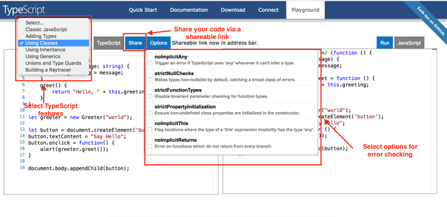
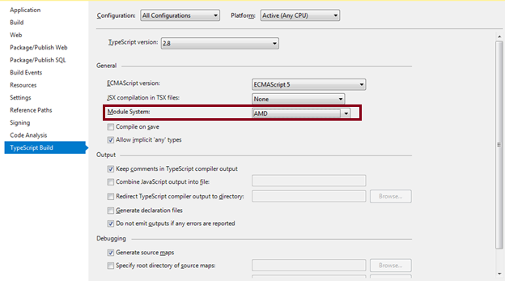

https://www.tutorialsteacher.com/typescript  

https://www.geeksforgeeks.org/typescript-accessor/


[TOC]


# TypeScript Playground

TypeScript provides an online playground https://www.typescriptlang.org/play to write and test your code on the fly without the need to download or install anything.

This is a great place for beginners just starting to learn TypeScript who want to try different TypeScript features. You also have the option to share your code via a shareable link provided by the playground.

Additionally, you can also select options for error checking your code!

[](https://www.tutorialsteacher.com/Content/images/typescript/ts-playground.png)

## Install TypeScript using Node.js Package Manager

Node.js package manager is used to set up TypeScript on your local environment.

To run TypeScript locally you will need: Node.js, TypeScript, and a code editor of your choice. Learn how to install Node.js in the [install Node.js](https://www.tutorialsteacher.com/nodejs/setup-nodejs-development-environment) chapter.

We will be using Node.js package manager (npm) to install TypeScript. To install or update TypeScript, open command prompt/terminal and type the following command:

```shell
> npm install -g typescript

# Once installed, you can check the TypeScript version using the following command:

> tsc -v
Version 3.9.5
```

Create a new file in your code editor and name it "add.ts". Write the following code in it:

File: add.ts

```ts
function addNumbers(a: number, b: number) { 
    return a + b; 
} 
var sum: number = addNumbers(10,15) 
console.log('Sum of the two numbers is: ' +sum); 
```

# TypeScript - Variable

TypeScript follows the same rules as JavaScript for variable declarations. Variables can be declared using: `var`, `let`, and `const`.

## var

Variables in TypeScript can be declared using var keyword, same as in JavaScript. The scoping rules remains the same as in JavaScript.

## let

To solve problems with `var` declarations, ES6 introduced two new types of variable declarations in JavaScript, using the keywords `let` and `const`. TypeScript, being a superset of JavaScript, also supports these new types of variable declarations.

Example: Variable Declaration using let

 Copy

```ts
let employeeName = "John";
// or 
let employeeName:string = "John";
```

The let declarations follow the same syntax as var declarations. Unlike variables declared with `var`, variables declared with `let` have a block-scope. This means that the scope of let variables is limited to their containing block, e.g. function, if else block or loop block. Consider the following example.

Example: let Variables Scope

 Copy

```ts
let num1:number = 1; 
    
function letDeclaration() { 
    let num2:number = 2; 

    if (num2 > num1) { 
        let num3: number = 3;
        num3++; 
    } 

    while(num1 < num2) { 
        let num4: number = 4;
        num1++;
    }

    console.log(num1); //OK
    console.log(num2); //OK 
    console.log(num3); //Compiler Error: Cannot find name 'num3'
    console.log(num4); //Compiler Error: Cannot find name 'num4'
}

letDeclaration();
```

## Advantages of using let over var

**1) Block-scoped let variables cannot be read or written to before they are declared.**

Example: let vs var

 Copy

```ts
console.log(num1); // Compiler Error: error TS2448: Block-scoped variable 'num' used before its declaration
let num1:number = 10 ;

console.log(num2); // OK, Output: undefined 
var num2:number = 10 ;
```

In the above example, the TypeScript compiler will give an error if we use variables before declaring them using let, whereas it won't give an error when using variables before declaring them using var.

**2) Let variables cannot be re-declared**

The TypeScript compiler will give an error when variables with the same name (case sensitive) are declared multiple times in the same block using let.

Example: Multiple Variables with the Same Name

 Copy

```ts
var num:number = 1; // OK
var Num:number = 2;// OK
var NUM:number = 3;// OK
var NuM:number = 4;// OK

let num:number = 5;// Compiler Error: Cannot redeclared block-scoped variable 'num'
let Num:number = 6;// Compiler Error: Cannot redeclared block-scoped variable 'Num'
let NUM:number = 7;// Compiler Error: Cannot redeclared block-scoped variable 'NUM'
let NuM:number = 8;// Compiler Error: Cannot redeclared block-scoped variable 'NuM'
```

In the above example, the TypeScript compiler treats variable names as case sensitive. `num` is different than `Num`, so it won't give any error. However, it will give an error for the variables with the same name and case.

Variables with the same name and case can be declared in different blocks, as shown below.

Example: Same Variable Name in Different Blocks

```ts
let num:number = 1; 

function demo() {
    let num:number = 2;

    if(true) { 
        let num:number = 3;
        console.log(num); //Output: 3
    }

    console.log(num);//Output: 2
}
console.log(num); //Output: 1
demo();
```

Similarly, the compiler will give an error if we declare a variable that was already passed in as an argument to the function, as shown below.

```ts
function letDemo(a: number ) { 
    let a:number = 10 ; //Compiler Error: TS2300: Duplicate identifier 'a'
    let b:number = 20 ; 

    return a + b ;
}
```

Thus, variables declared using `let` minimize the possibilities of runtime errors, as the compiler give compile-time errors. This increases the code readability and maintainability.

## Const

Variables can be declared using const similar to var or let declarations. The const makes a variable a constant where its value **cannot be changed.** Const variables have the same scoping rules as let variables.

Example: Const Variable

```ts
const num:number = 100;
num = 200; //Compiler Error: Cannot assign to 'num' because it is a constant or read-only property
```

Const variables must be declared and initialized in a single statement. Separate declaration and initialization is not supported.

```ts
const num:number; //Compiler Error: const declaration must be initialized
num = 100; 
```

Const variables allow an object sub-properties to be changed but not the object structure.

Example: const Object

```ts
const playerCodes = { 
    player1 : 9, 
    player2 : 10, 
    player3 : 13, 
    player4 : 20
}; 
playerCodes.player2 = 11; // OK

playerCodes = {     //Compiler Error: Cannot assign to playerCodes because it is a constant or read-only
    player1 : 50,   // Modified value
    player2 : 10, 
    player3 : 13, 
    player4 : 20
}; 
```

Even if you try to change the object structure, the compiler will point this error out.

```ts
const playerCodes = { 
    player1: 9, 
    player2: 10, 
    player3: 13, 
    player4: 20
}; 

playerCodes = { //Compiler Error: Cannot assign to playerCodes because it is a constant or read-only
    player1: 9, 
    player2: 10, 
    player3: 13, 
    player4: 20, 
    player5: 22
}; 
```

# TypeScript Data Type - Number

Just like JavaScript, TypeScript supports number data type. All numbers are stored as floating point numbers. These numbers can be Decimal (base 10), Hexadecimal (base 16) or Octal (base 8).

Example: TypeScript Number Type Variables

 Copy

```ts
let first:number = 123; // number 
let second: number = 0x37CF;  // hexadecimal
let third:number=0o377 ;      // octal
let fourth: number = 0b111001;// binary  

console.log(first);  // 123 
console.log(second); // 14287
console.log(third);  // 255
console.log(fourth); // 57 
```

In the above example, `let first:number = 1;` stores a positive integer as a number. `let second: number = 0x37CF;` stores a hexadecimal as a number which is equivalent to 14287. When you print this number on your browser's console, it prints the equivalent floating point of the hexadecimal number. `let third:number=0377;` stores an octal number equivalent to 255.

## Number Methods

| Method                                                       | Description                                                  |
| ------------------------------------------------------------ | ------------------------------------------------------------ |
| [toExponential()](https://www.tutorialsteacher.com/typescript/typescript-number#toexponential) | Returns the exponential notation in string format.           |
| [toFixed()](https://www.tutorialsteacher.com/typescript/typescript-number#tofixed) | Returns the fixed-point notation in string format.           |
| [toLocaleString()](https://www.tutorialsteacher.com/typescript/typescript-number#tolocalestring) | Converts the number into a local specific representation of the number. |
| [toPrecision()](https://www.tutorialsteacher.com/typescript/typescript-number#toprecision) | Returns the string representation in exponential or fixed-point to the specified precision. |
| [toString()](https://www.tutorialsteacher.com/typescript/typescript-number#tostring) | Returns the string representation of the number in the specified base. |
| [valueOf()](https://www.tutorialsteacher.com/typescript/typescript-number#valueof) | Returns the primitive value of the number.                   |

## toExponential()

The toExponential method returns the exponential notation of a number in string format, based on the specified fraction digits.

Signature:

```
numObj.toExponential([fractionDigits])
```

This function takes in one argument, an optional integer specifying the number of digits after the decimal point. It returns the exponential representation of the number in a string format.

Example: toExponential()

 Copy

```ts
let myNumber: number = 123456;

myNumber.toExponential(); // returns 1.23456e+5
myNumber.toExponential(1); //returns 1.2e+5
myNumber.toExponential(2); //returns 1.23e+5
myNumber.toExponential(3); //returns 1.235e+5
```

## toFixed()

The toFixed method returns the fixed-point notation of a number in string format.

Signature:

```
numObj.toFixed([digits])
```

This function has one optional argument, an integer specifying the number of digits after the decimal point. It returns a string representation of the formatted number.

Example: toFixed()

 Copy

```ts
let myNumber: number = 10.8788;

myNumber.toFixed(); // returns 11
myNumber.toFixed(1); //returns 10.9
myNumber.toFixed(2); //returns 10.88
myNumber.toFixed(3); //returns 10.879
myNumber.toFixed(4); //returns 10.8788
```

## toLocaleString()

The toLocaleString method converts the number into a local specific representation of the number.

Signature:

```
numObj.toLocaleString([locales [, options]])
```

This function takes in two arguments: the locale, and an optional options argument representing the locale to which you would like to get the equivalent number representation. In the below example, we pass the string 'de-DE' which is the locale for German.

Example: toLocaleString()

 Copy

```ts
let myNumber: number = 10667.987;

myNumber.toLocaleString(); // returns 10,667.987 - US English
myNumber.toLocaleString('de-DE'); // returns 10.667,987 - German
myNumber.toLocaleString('ar-EG'); // returns 10667.987 in Arebic
```

## toPrecision()

The toPrecision method returns the string representation in exponential or fixed-point to the specified precision.

Signature:

```
numObj.toPrecision([precision])
```

This function takes in one optional argument, a number representing the precision i.e. the number of significant digits. It returns a string representation to the specified precision.

Example: toPrecision()

 Copy

```ts
let myNumber: number = 10.5679;

myNumber.toPrecision(1); // returns 1e+1
myNumber.toPrecision(2); // returns 11
myNumber.toPrecision(3); // returns 10.6
myNumber.toPrecision(4); // returns 10.57
```

## toString()

The toString method returns a string representation of the number in the specified base.

Signature:

```
numObj.toString([radix])
```

This function takes in one optional argument, a radix number representing the base for which a string representation is to be returned. The radix value should be between 2 and 36.

Example: toString()

 Copy

```ts
let myNumber: number = 123;
myNumber.toString(); // returns '123'
myNumber.toString(2); // returns '1111011'
myNumber.toString(4); // returns '1323'
myNumber.toString(8); // returns '173'
myNumber.toString(16); // returns '7b'
myNumber.toString(36); // returns '3f'
```

## valueOf()

The valueOf method returns the primitive value of the number.

Signature:

```
numObj.valueOf()
```

This function returns the primitive value of the Object being called on.

Example: valueOf()

 Copy

```ts
let myNumber = new Number(123);
console.log(myNumber) //Output: a number object with value 123
console.log(myNumber.valueOf()) //Output: 123
console.log(typeof num) //Output: object

let num2 = num.valueOf() 
console.log(num2) //Output: 123
console.log(typeof num2) //Output: number
```

#   TypeScript - String

String is another primitive data type that is used to store text data. String values are surrounded by single quotation marks or double quotation marks.

Example: TypeScript String Type Variable

 Copy

```ts
let employeeName:string = 'John Smith'; 
//OR
let employeeName:string = "John Smith"; 
```

## Template String

Since TypeScript version 1.4, TypeScript has included support for ES6 Template strings. Template strings are used to embed expressions into strings.

Example: Template String Pre-ES6

 Copy

```ts
let employeeName:string = "John Smith"; 
let employeeDept:string = "Finance"; 

// Pre-ES6 
let employeeDesc1: string = employeeName + " works in the " + employeeDept + " department."; 

// Post-ES6 
let employeeDesc2: string = `${employeeName} works in the ${employeeDept} department.`; 

console.log(employeeDesc1);//John Smith works in the Finance department. 
console.log(employeeDesc2);//John Smith works in the Finance department. 
```

Here, instead of writing a string that is a combination of text and variables with concatenations, we can use a single statement with back-ticks ```. The variable values are written as `${}`. Using template strings, it is easier to embed expressions and also less tedious to write long text-based strings.

## String methods

| Method                                                       | Description                                                  |
| ------------------------------------------------------------ | ------------------------------------------------------------ |
| [charAt()](https://www.tutorialsteacher.com/typescript/typescript-string#charat) | Returns the character at the given index                     |
| [concat()](https://www.tutorialsteacher.com/typescript/typescript-string#concat) | Returns a combination of the two or more specified strings   |
| [indexOf()](https://www.tutorialsteacher.com/typescript/typescript-string#indexof) | Returns an index of first occurrence of the specified substring from a string (-1 if not found) |
| [replace()](https://www.tutorialsteacher.com/typescript/typescript-string#replace) | Replaces the matched substring with a new substring          |
| [split()](https://www.tutorialsteacher.com/typescript/typescript-string#split) | Splits the string into substrings and returns an array       |
| [toUpperCase()](https://www.tutorialsteacher.com/typescript/typescript-string#touppercase) | Converts all the characters of the string into upper case    |
| [toLowerCase()](https://www.tutorialsteacher.com/typescript/typescript-string#tolowercase) | Converts all the characters of the string into lower case    |
| charCodeAt()                                                 | Returns a number that is the UTF-16 code unit value at the given index |
| codePointAt()                                                | Returns a nonnegative integer Number that is the code point value of the UTF-16 encoded code point starting at the specified index |
| includes()                                                   | Checks whether a string includes another string              |
| endsWith()                                                   | Checks whether a string ends with another string             |
| LastIndexOf()                                                | Returns the index of last occurrence of value in the string  |
| localeCompare()                                              | Checks whether a string comes before, after or is the same as the given string |
| match()                                                      | Matches a regular expression against the given string        |
| normalize()                                                  | Returns the Unicode Normalization Form of the given string.  |
| padEnd()                                                     | Pads the end of the current string with the given string     |
| padStart()                                                   | Pads the beginning of the current string with given string   |
| repeat()                                                     | Returns a string consisting of the elements of the object repeated in the given times. |
| search()                                                     | Searches for a match between a regular expression and a string |
| slice()                                                      | Returns a section of a string                                |
| startsWith()                                                 | Checks whether a string starts with another string           |
| substr()                                                     | Returns a string beginning at the specified location and of the given characters |
| substring()                                                  | Returns a string between the two given indexes               |
| toLocaleLowerCase()                                          | Returns a lower case string while respecting current locale  |
| toLocaleUpperCase()                                          | Returns an upper case string while respecting current locale |
| trim()                                                       | Trims the white space from beginning and end of string       |
| trimLeft()                                                   | Trims the white space from left side of the string           |
| trimRight()                                                  | Trims the white space from right side of the string          |

## charAt()

The charAt() method returns a character at the specified index from a string.

Signature:

```
character = str.charAt(index)
```

This method takes one number argument index and returns the character at the given index in the string.

Example: charAt()

 Copy

```ts
let str: string = 'Hello TypeScript';
str.charAt(0); // returns 'H'
str.charAt(2); // returns 'l'
"Hello World".charAt(2); returns 'l'
```

## concat()

The concat() method concatenates two or more specified strings.

Signature:

```
str.concat(string2[, string3, ..., stringN])
```

This method takes two or more arguments of strings and returns a concatenation of the given strings.

Example: concat()

 Copy

```ts
let str1: string = 'Hello';
let str2: string = 'TypeScript';
str1.concat(str2); // returns 'HelloTypeScript'
str1.concat(' ', str2); // returns 'Hello TypeScript'
str1.concat(' Mr. ', 'Bond'); // returns 'Hello Mr. Bond'
```

## indexOf()

The indexOf() method returns an index of first occurrence of the specified sub string from a string. The index starts from 0. It returns -1 if not found. the indexOf() method search is case-sensitive, so 't' and 'T' are different.

Optionally, you can specify an index as a second parameter to define where the searching should start from.

Signature:

```
str.indexOf(searchValue[, fromIndex])
```

This method takes two arguments, the search string and an optional index number denoting the location the searching should start.

Example: indexOf()

 Copy

```ts
let str: string = 'TypeScript';

str.indexOf('T'); // returns 0
str.indexOf('p'); // returns 2
str.indexOf('e'); // returns 3
str.indexOf('T', 1); // returns -1
str.indexOf('t', 1); // returns 9
```

## replace()

The replace() method replaces the matched substring with the specified string. The regular expression can also be used for searching.

Signature:

```
str.replace(regexp|substr, newSubstr|function)
```

This method takes two arguments: a regex of string to be found, and the new string that will replace the existing substring.

Example: replace()

 Copy

```ts
let str1: string = 'Hello Javascript';
let str2: string = 'TypeScript';

str1.replace('Java', 'Type'); // returns 'Hello TypeScript'
str1.replace('JavaScript', str2); // returns 'Hello TypeScript'
str1.replace(/Hello/gi, 'Hi'); // returns 'Hi TypeScript'
```

## split()

The split() method splits a string into substrings based on a specified separator character and returns an array of substrings.

Signature:

```
str.split([separator[, limit]])
```

This method takes two arguments: a separator string and an optional limit specifying the number of entries to be found.

Example: split()

 Copy

```ts
let str1: string = 'Apple, Banana, Orange';
let str2: string = ',';

str1.split(str2) // returns [ 'Apple', ' Banana', ' Orange' ]
str1.split(',') // returns [ 'Apple', ' Banana', ' Orange' ]
str1.split(',', 2) // returns [ 'Apple', ' Banana' ]
str1.split(',', 1) // returns [ 'Apple']
```

## toUpperCase()

The toUpperCase() method returns an upper case representation of the string it is called on.

Example: toUpperCase()

 Copy

```ts
let str: string = 'Hello Typescript';
str.toUpperCase(); // returns 'HELLO TYPESCRIPT'
'hello typescript'.toUpperCase(); // returns 'HELLO TYPESCRIPT'
```

## toLowerCase()

The toLowerCase() method returns a lower case representation of the string it is called on.

Example: toLowerCase()

 Copy

```ts
let str: string = 'Hello Typescript';
str.toLowerCase(); // returns hello typescript
'HELLO TYPESCRIPT'.toLowerCase(); // returns hello typescript
```

# TypeScript Data Type - Boolean

Boolean values are supported by both JavaScript and TypeScript and stored as true/false values.

TypeScript Boolean:

```
let isPresent:boolean = true;
```

Note that, Boolean with an upper case B is different from boolean with a lower case b. Upper case Boolean is an object type whereas lower case boolean is a primitive type. It is always recommended to use boolean, the primitive type in your programs. This is because, while JavaScript coerces an object to its primitive type, the TypeScript type system does not. TypeScript treats it like an object type.

So, instead of writing `function checkExistence(b: Boolean)` it is recommended to use `function checkExistence(b: boolean)`.

# TypeScript - Arrays

An array is a special type of data type which can store multiple values of different data types sequentially using a special syntax.

TypeScript supports arrays, similar to JavaScript. There are two ways to declare an array:

**\1. Using square brackets. This method is similar to how you would declare arrays in JavaScript.**

```
let fruits: string[] = ['Apple', 'Orange', 'Banana'];
```

**\2. Using a generic array type, Array<elementType>.**

```
let fruits: Array<string> = ['Apple', 'Orange', 'Banana'];
```

Both methods produce the same output.

Of course, you can always initialize an array like shown below, but you will not get the advantage of TypeScript's type system.

```
let arr = [1, 3, 'Apple', 'Orange', 'Banana', true, false];
```

Arrays can contain elements of any data type, numbers, strings, or even objects.

Arrays can be declared and initialized separately.

Example: Array Declaration and Initialization

```js
let fruits: Array<string>;
fruits = ['Apple', 'Orange', 'Banana']; 

let ids: Array<number>;
ids = [23, 34, 100, 124, 44]; 
```

An array in TypeScript can contain elements of different data types using a generic array type syntax, as shown below.

Example: Multi Type Array

```js
let values: (string | number)[] = ['Apple', 2, 'Orange', 3, 4, 'Banana']; 
// or 
let values: Array<string | number> = ['Apple', 2, 'Orange', 3, 4, 'Banana']; 
```

## Accessing Array Elements:

The array elements can be accessed using the index of an element e.g. `ArrayName[index]`. The array index starts from zero, so the index of the first element is zero, the index of the second element is one and so on.

Example: Access Array Elements

```ts
let fruits: string[] = ['Apple', 'Orange', 'Banana']; 
fruits[0]; // returns Apple
fruits[1]; // returns Orange
fruits[2]; // returns Banana
fruits[3]; // returns undefined
```

Use the for loop to access array elements as shown below.

Example: Access Array Elements using Loop

```ts
let fruits: string[] = ['Apple', 'Orange', 'Banana']; 

for(var index in fruits)
{ 
    console.log(fruits[index]);  // output: Apple Orange Banana
}

for(var i = 0; i < fruits.length; i++)
{ 
    console.log(fruits[i]); // output: Apple Orange Banana
}
```

## Array Methods

The following table lists all Array methods which can be used for different purposes.

| Method           | Description                                                  |
| ---------------- | ------------------------------------------------------------ |
| pop()            | Removes the last element of the array and return that element |
| push()           | Adds new elements to the array and returns the new array length |
| sort()           | Sorts all the elements of the array                          |
| concat()         | Joins two arrays and returns the combined result             |
| indexOf()        | Returns the index of the first match of a value in the array (-1 if not found) |
| copyWithin()     | Copies a sequence of elements within the array               |
| fill()           | Fills the array with a static value from the provided start index to the end index |
| shift()          | Removes and returns the first element of the array           |
| splice()         | Adds or removes elements from the array                      |
| unshift()        | Adds one or more elements to the beginning of the array      |
| includes()       | Checks whether the array contains a certain element          |
| join()           | Joins all elements of the array into a string                |
| lastIndexOf()    | Returns the last index of an element in the array            |
| slice()          | Extracts a section of the array and returns the new array    |
| toString()       | Returns a string representation of the array                 |
| toLocaleString() | Returns a localized string representing the array            |

The following example demonstrates some of the array methods.

Example: Array Methods

 Copy

```ts
var fruits: Array<string> = ['Apple', 'Orange', 'Banana']; 
fruits.sort(); 
console.log(fruits); //output: [ 'Apple', 'Banana', 'Orange' ]

console.log(fruits.pop()); //output: Orange

fruits.push('Papaya'); 
console.log(fruits); //output: ['Apple', 'Banana', 'Papaya']

fruits = fruits.concat(['Fig', 'Mango']); 
console.log(fruits); //output: ['Apple', 'Banana', 'Papaya', 'Fig', 'Mango'] 

console.log(fruits.indexOf('Papaya'));//output: 2
```

# TypeScript - Tuples

TypeScript introduced a new data type called Tuple. Tuple can contain two values of different data types.

Consider the following example of number, string and tuple type variables.

Example: Tuple vs Other Data Types

```ts
var empId: number = 1;
var empName: string = "Steve";        

// Tuple type variable 
var employee: [number, string] = [1, "Steve"];
```

In the above example, we have defined a variable `empId` as number type and `empName` as string type with values. Here, we declared and assigned two variables to id and name of an employee. The same thing can be achieved by using a single tuple type variable. `employee` is the tuple type variable with two values of number and string type. Thus, removing the need to declare two different variables.

A tuple type variable can include multiple data types as shown below.

Example: Tuple

```ts
var employee: [number, string] = [1, "Steve"];
var person: [number, string, boolean] = [1, "Steve", true];

var user: [number, string, boolean, number, string];// declare tuple variable
user = [1, "Steve", true, 20, "Admin"];// initialize tuple variable
```

You can declare an array of tuple also.

Example: Tuple Array

```ts
var employee: [number, string][];
employee = [[1, "Steve"], [2, "Bill"], [3, "Jeff"]];
```

TypeScript generates an array in JavaScript for the tuple variable. For example, `var employee: [number, string] = [1, 'Steve']` will be compiled as `var employee = [1, "Steve"]` in JavaScript.

## Accessing Tuple Elements

We can access tuple elements using index, the same way as an array. An index starts from zero.

Example: Accessing Tuple

 Copy

```ts
var employee: [number, string] = [1, "Steve"];
employee[0]; // returns 1
employee[1]; // returns "Steve"
```

## Add Elements into Tuple

You can add new elements to a tuple using the push() method.

Example: push()

 Copy

```ts
var employee: [number, string] = [1, "Steve"];
employee.push(2, "Bill"); 
console.log(employee); //Output: [1, 'Steve', 2, 'Bill']
```

This is allowed because we are adding number and string values to the tuple and they are valid for the `employee` tuple.

Now, let's try to add a boolean value to the tuple.

```
employee.push(true) 
```

The above example will throw the following error:

```ts
test.ts(4,15): error TS2345: 
Argument of type 'true' is not assignable to parameter of type 'number | string'.
```

We get an error saying that adding a boolean value to a tuple of type 'number | string' is not permitted. Hence, a tuple declared as 'number | string' can store only number and string values.

The tuple is like an array. So, we can use [array methods](https://www.tutorialsteacher.com/typescript/typescript-array#array-methods) on tuple such as pop(), concat() etc.

Example: Use Array Methods

 Copy

```ts
var employee: [number, string] = [1, "Steve"];

// retrieving value by index and performing an operation 
employee[1] = employee[1].concat(" Jobs"); 
console.log(employee); //Output: [1, 'Steve Jobs']
```

# TypeScript Data Type - Enum

Enums or enumerations are a new data type supported in TypeScript. Most object-oriented languages like Java and C# use enums. This is now available in TypeScript too.

In simple words, enums allow us to declare a set of named constants i.e. a collection of related values that can be numeric or string values.

There are three types of enums:

1. Numeric enum
2. String enum
3. Heterogeneous enum

## Numeric Enum

Numeric enums are number-based enums i.e. they store string values as numbers.

Enums can be defined using the keyword enum. Let's say we want to store a set of print media types. The corresponding enum in TypeScript would be:

Example: Numeric Enum

```ts
enum PrintMedia {
  Newspaper,
  Newsletter,
  Magazine,
  Book
}
```

In the above example, we have an enum named **PrintMedia**. The enum has four values: Newspaper, Newsletter, Magazine, and Book. Here, enum values start from zero and increment by 1 for each member. It would be represented as:

```ts
Newspaper = 0
Newsletter = 1
Magazine = 2
Book = 3
```

**Enums are always assigned numeric values when they are stored**. The first value always takes the numeric value of 0, while the other values in the enum are incremented by 1.

We also have the option to initialize the first numeric value ourselves. For example, we can write the same enum as:

```
enum PrintMedia {
  Newspaper = 1,
  Newsletter,
  Magazine,
  Book
}
```

The first member, Newspaper, is initialized with the numeric value 1. The remaining members will be incremented by 1 from the numeric value of the first value. Thus, in the above example, Newsletter would be 2, Magazine would be 3 and Book would be 4.

It is not necessary to assign sequential values to Enum members. **They can have any values.**

```
enum PrintMedia {
    Newspaper = 1,
    Newsletter = 5,
    Magazine = 5,
    Book = 10
}
```

The enum can be used as a function parameter or return type, as shown below:

Example: Enum as Return Type

```ts
enum PrintMedia {
    Newspaper = 1,
    Newsletter,
    Magazine,
    Book
}

function getMedia(mediaName: string): PrintMedia {
    if (  mediaName === 'Forbes' || mediaName === 'Outlook') {
        return PrintMedia.Magazine;
    }
 }

let mediaType: PrintMedia = getMedia('Forbes'); // returns Magazine
```

In the above example, we declared an enum `PrintMedia`. Next, we declare a function `getMedia()` that takes in an input parameter `mediaName` of the type string. This function returns an enum `PrintMedia`. In the function, we check for the type of media. If the media name matches 'Forbes' or 'Outlook', we return enum member `PrintMedia.Magazine`.

### Computed Enums:

Numeric enums can include members with computed numeric value. The value of an enum member can be either a constant or computed. The following enum includes members with computed values.

Example: Computed Enum

```ts
enum PrintMedia {
    Newspaper = 1,
    Newsletter = getPrintMediaCode('newsletter'),
    Magazine = Newsletter * 3,
    Book = 10
}

function getPrintMediaCode(mediaName: string): number {
    if (mediaName === 'newsletter') {
        return 5;
    }
}

PrintMedia.Newsetter; // returns 5
PrintMedia.Magazine; // returns 15
```

When the enum includes computed and constant members, then uninitiated enum members either must come first or must come after other initialized members with numeric constants. The following will give an error.

```ts
enum PrintMedia {
    Newsletter = getPrintMediaCode('newsletter'),
    Newspaper, // Error: Enum member must have initializer
    Book,
    Magazine = Newsletter * 3,
}
```

The above enum can be declared as below.

```ts
enum PrintMedia {
    Newspaper,
    Book,
    Newsletter = getPrintMediaCode('newsletter'),
    Magazine = Newsletter * 3
}
// or
enum PrintMedia {
    Newsletter = getPrintMediaCode('newsletter'),
    Magazine = Newsletter * 3,
    Newspaper = 0,
    Book,
}
```

## String Enum

String enums are similar to numeric enums, except that the enum values are initialized with string values rather than numeric values.

The benefits of using string enums is that string enums offer better readability. If we were to debug a program, it is easier to read string values rather than numeric values.

Consider the same example of a numeric enum, but represented as a string enum:

Example: String Enum

 Copy

```ts
enum PrintMedia {
    Newspaper = "NEWSPAPER",
    Newsletter = "NEWSLETTER",
    Magazine = "MAGAZINE",
    Book = "BOOK"
}
// Access String Enum 
PrintMedia.Newspaper; //returns NEWSPAPER
PrintMedia['Magazine'];//returns MAGAZINE
```

In the above example, we have defined a string enum, PrintMedia, with the same values as the numeric enum above, with the difference that these enum values are initialized with string literals. The difference between numeric and string enums is that numeric enum values are auto-incremented, while string enum values need to be individually initialized.

## Heterogeneous Enum

Heterogeneous enums are enums that contain both string and numeric values.

Example: Heterogeneous Enum

 Copy

```ts
enum Status { 
    Active = 'ACTIVE', 
    Deactivate = 1, 
    Pending
}
```

## Reverse Mapping

Enum in TypeScript supports reverse mapping. It means we can access the value of a member and also a member name from its value. Consider the following example.

Example: Reverse Mapping

```ts
enum PrintMedia {
  Newspaper = 1,
  Newsletter,
  Magazine,
  Book
}

PrintMedia.Magazine;   // returns  3
PrintMedia["Magazine"];// returns  3
PrintMedia[3];         // returns  Magazine
```

As you can see in the above example, `PrintMedia[3]` returns its member name "Magazine". This is because of reverse mapping. Let's see how TypeScript implements reverse mapping using the following example.

```ts
enum PrintMedia {
  Newspaper = 1,
  Newsletter,
  Magazine,
  Book
}
console.log(PrintMedia)
```

The above example gives the following output in the browser console.

```ts
{
  '1': 'Newspaper',
  '2': 'Newsletter',
  '3': 'Magazine',
  '4': 'Book',
  Newspaper: 1,
  Newsletter: 2,
  Magazine: 3,
  Book: 4 
}
```

You will see that each value of the enum appears twice in the internally stored enum object. We know that num values can be retrieved using the corresponding enum member value. But it is also true that enum members can be retrieved using their values. This is called reverse mapping.

TypeScript can compile the above enum into the following JavaScript function.

Example: Compiled JavaScript of Enum

```ts
var PrintMedia;
(function (PrintMedia) {
    PrintMedia[PrintMedia["Newspaper"] = 1] = "Newspaper";
    PrintMedia[PrintMedia["Newsletter"] = 2] = "Newsletter";
    PrintMedia[PrintMedia["Magazine"] = 3] = "Magazine";
    PrintMedia[PrintMedia["Book"] = 4] = "Book";
})(PrintMedia || (PrintMedia = {}));
```

`PrintMedia` is an object in JavaScript which includes both value and name as properties and that's why enum in TypeScript supports reverse mapping.

So, both the following mappings are true to enums: name -> value, and value -> name.

 **Note**:

>  Reverse mapping is not supported for string enum members. For the heterogeneous enum, reverse mapping is only supported for numeric type members but not for string type members.

# TypeScript - Union

TypeScript allows us to use more than one data type for a variable or a function parameter. This is called union type.

Syntax:

```
(type1 | type2 | type3 | .. | typeN)
```

Consider the following example of union type.

Example: Union

 Copy

```ts
let code: (string | number);
code = 123;   // OK
code = "ABC"; // OK
code = false; // Compiler Error

let empId: string | number;
empId = 111; // OK
empId = "E111"; // OK
empId = true; // Compiler Error
```

In the above example, variable `code` is of union type, denoted using `(string | number)`. So, you can assign a string or a number to it.

The function parameter can also be of union type, as shown below.

Example: Function Parameter as Union Type

 Copy

```ts
function displayType(code: (string | number))
{
    if(typeof(code) === "number")
        console.log('Code is number.')
    else if(typeof(code) === "string")
        console.log('Code is string.')
}

displayType(123); // Output: Code is number.
displayType("ABC"); // Output: Code is string.
displayType(true); //Compiler Error: Argument of type 'true' is not assignable to a parameter of type string | number
```

In the above example, parameter `code` is of union type. So, you can pass either a string value or a number value. If you pass any other type of value e.g. boolean, then the compiler will give an error.

# TypeScript Data Type - Any

TypeScript has type-checking and compile-time checks. However, we do not always have prior knowledge about the type of some variables, especially when there are user-entered values from third party libraries. In such cases, we need a provision that can deal with dynamic content. The Any type comes in handy here.

Example: Any

```ts
let something: any = "Hello World!"; 
something = 23;
something = true;
```

The above code will compile into the following JavaScript.

```ts
var something = "Hello World!";
something = 23;
something = true;
```

Similarly, you can create an array of type any[] if you are not sure about the types of values that can contain this array.

Example: Any type Array

 Copy

```ts
let arr: any[] = ["John", 212, true]; 
arr.push("Smith"); 
console.log(arr); //Output: [ 'John', 212, true, 'Smith' ] 
```

The above example will generate the following JavaScript code:

```ts
var arr = ["John", 212, true];
arr.push("Smith");
console.log(arr);
```

# TypeScript Data Type - Void

Similar to languages like Java, void is used where there is no data type. For example, in return type of functions that do not return any value.

Example: void

 Copy

```ts
function sayHi(): void { 
    console.log('Hi!')
} 

let speech: void = sayHi(); 
console.log(speech); //Output: undefined
```

There is no meaning to assign void to a variable, as only null or undefined is assignable to void.

```ts
let nothing: void = undefined;
let num: void = 1; // Error
```

# TypeScript Data Type - Never

TypeScript introduced a new type `never`, which indicates the values that will never occur.

The never type is used when you are sure that something is never going to occur. For example, you write a function which will not return to its end point or always throws an exception.

Example: never

 Copy

```
function throwError(errorMsg: string): never { 
            throw new Error(errorMsg); 
} 

function keepProcessing(): never { 
            while (true) { 
         console.log('I always does something and never ends.')
     }
}
```

In the above example, the `throwError()` function throws an error and `keepProcessing()` function is always executing and never reaches an end point because the while loop never ends. Thus, never type is used to indicate the value that will never occur or return from a function.

## Difference between never and void

The void type can have undefined or null as a value where as never cannot have any value.

Example: never vs void

 Copy

```ts
let something: void = null;
let nothing: never = null; // Error: Type 'null' is not assignable to type 'never'
```

In TypeScript, a function that does not return a value, actually returns undefined. Consider the following example.

```ts
function sayHi(): void { 
    console.log('Hi!')
}

let speech: void = sayHi();
console.log(speech); // undefined
```

As you can see in the above example, `speech` is undefined, because the `sayHi` function internally returns undefined even if return type is void. If you use never type, `speech:never` will give a compile time error, as void is not assignable to never.

# Type Inference in TypeScript

TypeScript is a typed language. However, it is not mandatory to specify the type of a variable. TypeScript infers types of variables when there is no explicit information available in the form of type annotations.

Types are inferred by TypeScript compiler when:

- Variables are initialized
- Default values are set for parameters
- Function return types are determined

For example,

```
var a = "some text"
```

Here, since we are not explicitly defining `a: string` with a type annotation, TypeScript infers the type of the variable based on the value assigned to the variable. The value of a is a string and hence the type of a is inferred as string.

Consider the following example:

```ts
var a = "some text";
var b = 123;
a = b; // Compiler Error: Type 'number' is not assignable to type 'string'
```

The above code shows an error because while inferring types, TypeScript inferred the type of variable `a` as string and variable `b` as number. When we try to assign `b` to `a`, the compiler complains saying a number type cannot be assigned to a string type.

## Type inference in complex objects

There may be scenarios where an object may be initialized with multiple types.

For example:

```
var arr = [ 10, null, 30, 40 ];
```

In the above example, we have an array that has the values 10, null, 30, and, 40 . TypeScript looks for the most common type to infer the type of the object. In this case, it picks the one thats is compatible with all types i.e. number, as well as null.

Consider another example:

```
var arr = [0, 1, "test"];
```

Here, the array has values of type number as well as type string. In such cases, the TypeScript compiler looks for the most common type to infer the type of the object but does not find any super type that can encompass all the types present in the array. In such cases, the compiler treats the type as a union of all types present in the array. Here, the type would be `(string | number)` which means that the array can hold either string values or number values. This is called [union type](https://www.tutorialsteacher.com/typescript/typescript-union).

Lets try to add a new element to the array:

```ts
var arr = [0, 1, "test"]; 
arr.push("str") 
```

The compiler accepts the new value since the new value is of type string which is okay.

Now, lets try to add a new type to the array which was not already a part of the array:

```ts
var arr = [0, 1, "test"]; 
arr.push("str") // OK
arr.push(true); // Compiler Error: Argument of type 'true' is not assignable to parameter of type 'string | number'
```

The above code will show a compiler error because `boolean` is not a part of union `(string | number)`.

**The return type of a function is also inferred by the returning value**. For example:

```ts
function sum(a: number, b: number )
{
    return a + b;    
}
var total: number = sum(10,20); // OK
var str: string = sum(10,20); // Compiler Error 
```

In the above function, return type of the function `sum` is number. So, the result can be stored in a number type variable but not a string type variable.

Thus, type inference is helpful in type-checking when there are no explicit type annotations available.

# Type Assertion in TypeScript

Here, you will learn about how TypeScript infers and checks the type of a variable using some internal logic mechanism called Type Assertion.

Type assertion allows you to set the type of a value and tell the compiler not to infer it. This is when you, as a programmer, might have a better understanding of the type of a variable than what TypeScript can infer on its own. Such a situation can occur when you might be porting over code from JavaScript and you may know a more accurate type of the variable than what is currently assigned. It is similar to type casting in other languages like C# and Java. However, unlike C# and Java, there is no runtime effect of type assertion in TypeScript. It is merely a way to let the TypeScript compiler know the type of a variable.

Example: Type Assertion

 Copy

```ts
let code: any = 123; 
let employeeCode = <number> code; 
console.log(typeof(employeeCode)); //Output: number
```

In the above example, we have a variable `code` of type `any`. We assign the value of this variable to another variable called `employeeCode`. However, we know that code is of type number, even though it has been declared as 'any'. So, while assigning `code` to `employeeCode`, we have asserted that code is of type number in this case, and we are certain about it. Now, the type of `employeeCode` is number.

Similarly, we might have a situation where we have an object that has been declared without any properties yet.

Example: Type Assertion with Object

 Copy

```ts
let employee = { };
employee.name = "John"; //Compiler Error: Property 'name' does not exist on type '{}'
employee.code = 123; //Compiler Error: Property 'code' does not exist on type '{}'
```

The above example will give a compiler error, because the compiler assumes that the type of employee is {} with no properties. But, we can avoid this situation by using type assertion, as shown below.

Example: Type Assertion with Object

```ts
interface Employee { 
    name: string; 
    code: number; 
} 

let employee = <Employee> { }; 
employee.name = "John"; // OK
employee.code = 123; // OK
```

In the above example, we created an interface `Employee` with the properties name and code. We then used this type assertion on employee. Interfaces are used to define the structure of variables. Learn more about this in [interface](https://www.tutorialsteacher.com/typescript/typescript-interface) chapter.

Be careful while using type assertion. The TypeScript compiler will autocomplete `Employee` properties, but it won't show any compile time error if you forgot to add the properties. For example:

```ts
interface Employee { 
    name: string; 
    code: number; 
} 

let employee = <Employee> { 
    // Compiler will provide autocomplete properties,
    // but will not give an error if you forgot to add the properties
}; 
console.log(employee.name); // undefined; 
```

You can also use the JavaScript library in TypeScript for some existing functions.

```ts
let employeeCode = <number> myJSLib.GetEmployeeCode('Steve');
console.log(typeof(employeeCode)); // number
```

In the above example, we assume that `myJSLib` is a separate JavaScript library and we call its `GetEmployeeCode()` function. So, we set the type of return value as number because we know that it returns a number.

There are two ways to do type assertion in TypeScript:

**\1. Using the angular bracket <> syntax. So far in this section, we have used angular brackets to show type assertion.**

```ts
let code: any = 123; 
let employeeCode = <number> code; 
```

However, there is another way to do type assertion, using the 'as' syntax.

**\2. Using as keyword**

Example: as syntax

```ts
let code: any = 123; 
let employeeCode = code as number;
```

Both the syntaxes are equivalent and we can use any of these type assertions syntaxes. However, while dealing with JSX in TypeScript, only the `as` syntax is allowed, because JSX is embeddable in XML like a syntax. And since XML uses angular brackets, it creates a conflict while using type assertions with angular brackets in JSX.

# TypeScript - if else

An if statement can include one or more expressions which return boolean. If the boolean expression evaluates to true, a set of statements is then executed.

Example: if

 Copy

```ts
if (true) 
{
    console.log('This will always executed.');
}

if (false) {
    console.log('This will never executed.');
}    
```

The following example includes multiple boolean expressions in the if condition.

Example: if

 Copy

```ts
let x: number = 10, y = 20;

if (x < y) 
{
    console.log('x is less than y');
} 
```

In the above example, the if condition expression `x < y` is evaluated to true and so it executes the statement within the curly { } brackets.

## if else Condition

An if else condition includes two blocks - if block and an else block. If the `if` condition evaluates to true, then the `if` block is executed. Otherwies, the `else` block is executed.

Example: if else

 Copy

```ts
let let x: number = 10, y = 20;

if (x > y) 
{
    console.log('x is greater than y.');
} 
else
{
    console.log('x is less than or equal to y.'); //This will be executed
}
```

In the above example, the else block will be executed. Remember: else cannot include any condition and it must follow `if` or `else if` conditions.

### else if

The else if statement can be used after the if statement.

Example: else if

 Copy

```ts
let x: number = 10, y = 20;

if (x > y) 
{
    console.log('x is greater than y.');
} 
else if (x < y)
{
    console.log('x is less than y.'); //This will be executed
}
else if (x == y) 
{
    console.log('x is equal to y');
}
```

## Ternary operator

A ternary operator is denoted by '?' and is used as a short cut for an if..else statement. It checks for a boolean condition and executes one of the two statements, depending on the result of the boolean condition.

Syntax:

```
Boolean expression? First statement : second statement
```

Example:

 Copy

```ts
let x: number = 10, y = 20;

x > y? console.log('x is greater than y.'): console.log('x is less than or equal to y.')
```

Result:

```
x is less than or equal to y.
```

# TypeScript - switch

The switch statement is used to check for multiple values and executes sets of statements for each of those values. A switch statement has one block of code corresponding to each value and can have any number of such blocks. When the match to a value is found, the corresponding block of code is executed.

Syntax:

```ts
switch(expression) { 
   case constant-expression1: { 
      //statements; 
      break; 
   } 
   case constant_expression2: { 
      //statements; 
      break; 
   } 
   default: { 
      //statements; 
      break; 
   } 
} 
```

The following rules are applied on the switch statement:

1. The switch statement can include constant or variable expression which can return a value of any data type.
2. There can be any number of case statements within a switch. The case can include a constant or an expression.
3. We must use break keyword at the end of each case block to stop the execution of the case block.
4. The return type of the switch expression and case expression must match.
5. The default block is optional.

Consider the following example.

Example: switch

 Copy

```ts
let day : number = 4;

switch (day) {
    case 0:
        console.log("It is a Sunday.");
        break;
    case 1:
        console.log("It is a Monday.");
        break;
    case 2:
        console.log("It is a Tuesday.");
        break;
    case 3:
        console.log("It is a Wednesday.");
        break;
    case 4:
        console.log("It is a Thursday.");
        break;
    case 5:
        console.log("It is a Friday.");
        break;
    case 6:
        console.log("It is a Saturday.");
        break;
    default:
        console.log("No such day exists!");
        break;
}
```

# TypeScript - for Loops

TypeScript supports the following for loops:

1. for loop
2. for..of loop
3. for..in loop

## for Loop

The for loop is used to execute a block of code a given number of times, which is specified by a condition.

Syntax:

```ts
for (first expression; second expression; third expression ) {
    // statements to be executed repeatedly
}
```

Here, the first expression is executed before the loop starts. The second expression is the condition for the loop to execute. And the third expression is executed after the execution of every code block.

Example: for Loop

 Copy

```ts
for (let i = 0; i < 3; i++) {
  console.log ("Block statement execution no." + i);
}
```

Result:

```ts
Block statement execution no.0
Block statement execution no.1
Block statement execution no.2
```

In the above example, the first statement `let i = 0` declares and initializes a variable. The second conditional statement `i < 3` checks whether the value of `i` is less than 3 or not, and if it is then it exits the loop. The third statement `i++` increases the value of `i` by 1. Thus, the above loop will execute the block three times, until the value of `i` becomes 3.

## for...of Loop

TypeScript includes the **for...of** loop to iterate and access elements of an array, list, or tuple collection. The for...of loop returns elements from a collection e.g. array, list or tuple, and so, there is no need to use the traditional for loop shown above.

Example: for..of Loop

```ts
let arr = [10, 20, 30, 40];

for (var val of arr) {
  console.log(val); // prints values: 10, 20, 30, 40
}
```

The for...of loop can also return a character from a string value.

Example: for..of Loop

```ts
let str = "Hello World";

for (var char of str) {
  console.log(char); // prints chars: H e l l o  W o r l d
}
```

## for...in Loop

Another form of the for loop is `for...in`. This can be used with an array, list, or tuple. The for...in loop iterates through a list or collection and returns an index on each iteration.

Example: for..in Loop

 Copy

```ts
let arr = [10, 20, 30, 40];

for (var index in arr) {
  console.log(index); // prints indexes: 0, 1, 2, 3

  console.log(arr[index]); // prints elements: 10, 20, 30, 40
}
```

You can also use `let` instead of `var`. The difference is that the variable declared using `let` will not be accessible out of the for..in loop, as shown below.

Example: for..in Loop

```ts
let arr = [10, 20, 30, 40];

for (var index1 in arr) {
  console.log(index1); // prints indexes: 0, 1, 2, 3
}
console.log(index1); //OK, prints 3 

for (let index2 in arr) {
  console.log(index2); // prints elements: 0, 1, 2, 3
}
console.log(index2); //Compiler Error: Cannot find index2
```

# TypeScript - while Loop

The while loop is another type of loop that checks for a specified condition before beginning to execute the block of statements. The loop runs until the condition value is met.

Syntax:

```ts
while (condition expression) {
    // code block to be executed
}
```

The condition expression checks for a specified condition before running the block of code.

Example: while loop

 Copy

```ts
let i: number = 2;

while (i < 4) {
    console.log( "Block statement execution no." + i )
    i++;
}
```

Result:

```
Block statement execution no.2
Block statement execution no.3
```

In the above example, we declared a variable `i` with the value 2. The while loop checks for the value of `i` before executing the while block of code. If `i < 4`, then it executes the block. Within the block of code, we have a statement to increment the value of `i` by 1. This means, the while loop runs two times, for `i = 2`, and `i = 3`.

Note that, in the above example, if we hadn't incremented the value of `i` inside the loop, every time the loop condition was checked, `i` would have remained the same, i.e. with the initial value of 2. Since the condition `i < 4` would have always been true, the loop would have run infinite times.

## do..while loop

The do..while loop is similar to the while loop, except that the condition is given at the end of the loop. The do..while loop runs the block of code at least once before checking for the specified condition. For the rest of the iterations, it runs the block of code only if the specified condition is met.

Syntax:

```ts
do {
// code block to be executed
}
while (condition expression);
```

Example: do..while loop

 Copy

```ts
let i: number = 2;
do {
    console.log("Block statement execution no." + i )
    i++;
} while ( i < 4)
```

Result:

```
Block statement execution no.2
Block statement execution no.3
```

In the above example, we have a variable i initialized with value 2. The loop runs the block of code once, prints "Block statement execution no.2" and increments `i` to value 3. The loop then checks for the condition `i < 4`. Since `i` is less than 4, it runs the loop again, this time printing "Block statement execution no.3" and then incrementing the value of `i` to 4. The condition `i < 4` is evaluated again. This time the condition evaluates to false and the do...while loop ends.

Let's check whether the loop runs if the value of `i` is initialized to 4 before the loop begins:

```ts
let i: number = 4;
do {
    console.log( "Block statement execution no." + i )
    i++;
} while ( i < 4)
```

Result:

```
Block statement execution no.4
```

As you can see in the example above, even though the condition in the do...while loop is `i < 4`, the loop still runs once and prints "Block statement execution no.4". When the condition is evaluated at the end of the block, `i` is 4 and the condition evaluates to false, hence ending the loop!

# TypeScript - Functions

Functions are the primary blocks of any program. In JavaScript, functions are the most important part since the JavaScript is a functional programming language. With functions, you can implement/mimic the concepts of object-oriented programming like classes, objects, polymorphism, and, abstraction.

Functions ensure that the program is maintainable and reusable, and organized into readable blocks. While TypeScript provides the concept of classes and modules, functions still are an integral part of the language.

In TypeScript, functions can be of two types: named and anonymous.

## Named Functions

A named function is one where you declare and call a function by its given name.

Example: Named Function

 Copy

```ts
function display() {
    console.log("Hello TypeScript!");
}

display(); //Output: Hello TypeScript 
```

Functions can also include parameter types and return type.

Example: Function with Parameter and Return Types

 Copy

```ts
function Sum(x: number, y: number) : number {
    return x + y;
}

Sum(2,3); // returns 5
```

## Anonymous Function

An anonymous function is one which is defined as an expression. This expression is stored in a variable. So, the function itself does not have a name. These functions are invoked using the variable name that the function is stored in.

Example: Anonymous Function

 Copy

```ts
let greeting = function() {
    console.log("Hello TypeScript!");
};

greeting(); //Output: Hello TypeScript! 
```

An anonymous function can also include parameter types and return type.

Example: Function with Paramter and Return Types

 Copy

```ts
let Sum = function(x: number, y: number) : number
{
    return x + y;
}

Sum(2,3); // returns 5
```

## Function Parameters

Parameters are values or arguments passed to a function. In TypeScript, the compiler expects a function to receive the exact number and type of arguments as defined in the function signature. If the function expects three parameters, the compiler checks that the user has passed values for all three parameters i.e. it checks for exact matches.

Example: Function Parameters

 Copy

```ts
function Greet(greeting: string, name: string ) : string {
    return greeting + ' ' + name + '!';
}

Greet('Hello','Steve');//OK, returns "Hello Steve!"
Greet('Hi'); // Compiler Error: Expected 2 arguments, but got 1.
Greet('Hi','Bill','Gates'); //Compiler Error: Expected 2 arguments, but got 3.
```

This is unlike JavaScript, where it is acceptable to pass less arguments than what the function expects. The parameters that don't receive a value from the user are considered as `undefined`.

### Optional Parameters

TypeScript has an optional parameter functionality. The parameters that may or may not receive a value can be appended with a '?' to mark them as optional.

 Note:

All optional parameters must follow required parameters and should be at the end.

Example: Optional Parameter

 Copy

```ts
function Greet(greeting: string, name?: string ) : string {
    return greeting + ' ' + name + '!';
}

Greet('Hello','Steve');//OK, returns "Hello Steve!"
Greet('Hi'); // OK, returns "Hi undefined!".
Greet('Hi','Bill','Gates'); //Compiler Error: Expected 2 arguments, but got 3.
```

In the above example, the second parameter `name` is marked as optional with a question mark appended at the end. Hence, the function `Greet()` accepts either 1 or 2 parameters and returns a greeting string. If we do not specify the second parameter then its value will be `undefined`.

### Default Parameters

TypeScript provides the option to add default values to parameters. So, if the user does not provide a value to an argument, TypeScript will initialize the parameter with the default value. Default parameters have the same behaviour as optional parameters. If a value is not passed for the default parameter in a function call, the default parameter must follow the required parameters in the function signature. Hence, default parameters can be omitted while calling a function. However, if a function signature has a default parameter before a required parameter, the function can still be called, provided the default parameter is passed a value of undefined.

Example: Default Parameter

 Copy

```ts
function Greet(name: string, greeting: string = "Hello") : string {
    return greeting + ' ' + name + '!';
}

Greet('Steve');//OK, returns "Hello Steve!"
Greet('Steve', 'Hi'); // OK, returns "Hi Steve!".
Greet('Bill'); //OK, returns "Hello Bill!"
```

When the default parameters precede required parameters in a function, they can be called by passing `undefined`.

Example: Function Call

 Copy

```ts
function Greet(greeting: string = "Hello", name: string) : string {
    return greeting + ' ' + name + '!';
}

Greet(undefined, 'Steve');//returns "Hello Steve!"
Greet("Hi", 'Steve'); //returns "Hi Steve!".
Greet(undefined, 'Bill'); //returns "Hello Bill!"
```

# TypeScript - Arrow Functions

Fat arrow notations are used for anonymous functions i.e for function expressions. They are also called lambda functions in other languages.

Syntax:

```
(param1, param2, ..., paramN) => expression
```

Using fat arrow (=>) we drop the need to use the 'function' keyword. Parameters are passed in the angular brackets <>, and the function expression is enclosed within the curly brackets {}.

Example: Fat Arrow Function

 Copy

```ts
let sum = (x: number, y: number): number => {
    return x + y;
}

sum(10, 20); //returns 30
```

In the above example, `sum` is an arrow function. `(x:number, y:number)` denotes the parameter types, `:number` specifies the return type. The fat arrow `=>` separates the function parameters and the function body. The right side of `=>` can contain one or more code statements.

The above arrow function `sum` will be converted into the following JavaScript code.

```ts
var sum = function (x, y) {
    return x + y;
}
```

The following is an arrow function without parameters.

Example: Parameterless Arrow Function

 Copy

```ts
let Print = () => console.log("Hello TypeScript");

Print(); //Output: Hello TypeScript
```

Furthermore, if the function body consists of only one statement then no need for the curly brackets and the return keyword, as shown below.

```ts
let sum = (x: number, y: number) => x + y;

sum(3, 4); //returns 7
```

A class can include an arrow function as a property, as shown below.

Example: Arrow Function in Class

 Copy

```ts
class Employee {
    empCode: number;
    empName: string;

    constructor(code: number, name: string) {
        this.empName = name;
        this.empCode = code;
    }

    display = () => console.log(this.empCode +' ' + this.empName)
}
let emp = new Employee(1, 'Ram');
emp.display();
```

# TypeScript - Function Overloading

TypeScript provides the concept of function overloading. You can have multiple functions with the same name but different parameter types and return type. However, the number of parameters should be the same.

Example: Function Overloading

```ts
function add(a:string, b:string):string;

function add(a:number, b:number): number;

function add(a: any, b:any): any {
    return a + b;
}

add("Hello ", "Steve"); // returns "Hello Steve" 
add(10, 20); // returns 30 
```

In the above example, we have the same function `add()` with two function declarations and one function implementation. The first signature has two parameters of type string, whereas the second signature has two parameters of the type number.

The last function should have the function implementation. Since the return type can be either string or number as per the first two function declarations, we must use compatible parameters and return type as `any` in the function definition.

Function overloading with different number of parameters and types with same name is not supported.

Example: Function Overloading

```ts
function display(a:string, b:string):void //Compiler Error: Duplicate function implementation
{
    console.log(a + b);
}

function display(a:number): void //Compiler Error: Duplicate function implementation
{
    console.log(a);
}
```

Thus, in order to achieve function overloading, we must declare all the functions with possible signatures. Also, function implementation should have compatible types for all declarations.

# TypeScript - Rest Parameters

In the function chapter, you learned about functions and their parameters. TypeScript introduced rest parameters to accommodate n number of parameters easily.

When the number of parameters that a function will receive is not known or can vary, we can use rest parameters. In JavaScript, this is achieved with the "arguments" variable. However, with TypeScript, we can use the rest parameter denoted by ellipsis `...`.

We can pass zero or more arguments to the rest parameter. The compiler will create an array of arguments with the rest parameter name provided by us.

Example: Rest Parameters

 Copy

```ts
function Greet(greeting: string, ...names: string[]) {
    return greeting + " " + names.join(", ") + "!";
}

Greet("Hello", "Steve", "Bill"); // returns "Hello Steve, Bill!"

Greet("Hello");// returns "Hello !"
```

In the above example, we have a function with two parameters: `greeting` and `names`. Here, `names` is a rest parameter denoted by ellipses `...`. While calling the function, we first pass "Steve", "Bill" as the rest parameters. These are combined into a string array by joining the elements of the `names` array. Hence, it returns "Hello Steve, Bill!". During the second function call, we do not pass any arguments as the rest parameters. This is accepted by the compiler and hence the output is "Hello !"

The rest parameters can be used in functions, arrow functions or classes.

Example: Rest Parameters

 Copy

```ts
let Greet = (greeting: string, ...names: string[]) => {
    return greeting + " " + names.join(", ") + "!";
}

Greet("Hello", "Steve", "Bill"); // returns "Hello Steve, Bill!"

Greet("Hello");// returns "Hello !"
```

Remember, rest parameters must come last in the function defination, otherwise the TypeScript compiler will show an error. The following is not valid.

Example: **Wrong Rest Parameters**

```ts
function Greet(...names: string[], greeting: string) {  // Compiler Error
    return greeting + " " + names.join(", ") + "!";
}
```

# TypeScript - Interfaces

Interface is a structure that defines the contract in your application. It defines the syntax for classes to follow. Classes that are derived from an interface must follow the structure provided by their interface.

The TypeScript compiler does not convert interface to JavaScript. It uses interface for type checking. **This is also known as "duck typing" or "structural subtyping**".

An interface is defined with the keyword `interface` and it can include properties and method declarations using a function or an [arrow function](https://www.tutorialsteacher.com/typescript/arrow-function).

Example: Interface

 Copy

```ts
interface IEmployee {
    empCode: number;
    empName: string;
    getSalary: (number) => number; // arrow function
    getManagerName(number): string; 
}
```

In the above example, the `IEmployee` interface includes two properties `empCode` and `empName`. It also includes a method declaration `getSalaray` using an arrow function which includes one number parameter and a number return type. The `getManagerName` method is declared using a normal function. This means that any object of type `IEmployee` must define the two properties and two methods.

## Interface as Type

Interface in TypeScript can be used to define a type and also to implement it in the class.

The following interface `IEmployee` defines a type of a variable.

Example: Interface as Type

 Copy

```ts
interface KeyPair {
    key: number;
    value: string;
}

let kv1: KeyPair = { key:1, value:"Steve" }; // OK

let kv2: KeyPair = { key:1, val:"Steve" }; // Compiler Error: 'val' doesn't exist in type 'KeyPair'

let kv3: KeyPair = { key:1, value:100 }; // Compiler Error: 
```

In the above example, an interface `KeyPair` includes two properties `key` and `value`. A variable `kv1` is declared as `KeyPair` type. So, it must follow the same structure as `KeyPair`. It means only an object with properties `key` of number type and `value` of string type can be assigned to a variable `kv1`. The TypeScript compiler will show an error if there is any change in the name of the properties or the data type is different than `KeyPair`. Another variable `kv2` is also declared as `KeyPair` type but the assigned value is `val` instead of `value`, so this will cause an error. In the same way, kv3 assigns a number to the `value` property, so the compiler will show an error. Thus, TypeScript uses an interface to ensure the proper structure of an object.

## Interface as Function Type

TypeScript interface is also used to define a type of a function. This ensures the function signature.

Example: Function Type

```ts
interface KeyValueProcessor
{
    (key: number, value: string): void;
};

function addKeyValue(key:number, value:string):void { 
    console.log('addKeyValue: key = ' + key + ', value = ' + value)
}

function updateKeyValue(key: number, value:string):void { 
    console.log('updateKeyValue: key = '+ key + ', value = ' + value)
}
    
let kvp: KeyValueProcessor = addKeyValue;
kvp(1, 'Bill'); //Output: addKeyValue: key = 1, value = Bill 

kvp = updateKeyValue;
kvp(2, 'Steve'); //Output: updateKeyValue: key = 2, value = Steve 
```

In the above example, an interface `KeyValueProcessor` includes a method signature. This defines the function type. Now, we can define a variable of type `KeyValueProcessor` which can only point to functions with the same signature as defined in the `KeyValueProcessor` interface. So, `addKeyValue` or `updateKeyValue` function is assigned to `kvp`. So, `kvp` can be called like a function.

Trying to assign a function with a different signature will cause an error.

```ts
function delete(key:number):void { 
    console.log('Key deleted.')
}
    
let kvp: KeyValueProcessor = delete; //Compiler Error
```

## Interface for Array Type

An interface can also define the type of an array where you can define the type of index as well as values.

Example: Type of Array

```ts
interface NumList {
    [index:number]:number
}

let numArr: NumList = [1, 2, 3];
numArr[0];
numArr[1];

interface IStringList {
    [index:string]:string
}

let strArr : IStringList;
strArr["TS"] = "TypeScript";
strArr["JS"] = "JavaScript";
```

In the above example, interface `NumList` defines a type of array with index as number and value as number type. In the same way, `IStringList` defines a string array with index as string and value as string.

## Optional Property

Sometimes, we may declare an interface with excess properties but may not expect all objects to define all the given interface properties. We can have optional properties, marked with a "?". In such cases, objects of the interface may or may not define these properties.

Example: Optional Property

 Copy

```ts
interface IEmployee {
    empCode: number;
    empName: string;
    empDept?:string;
}

let empObj1:IEmployee = {   // OK
    empCode:1,
    empName:"Steve"
}

let empObj2:IEmployee = {    // OK
    empCode:1,
    empName:"Bill",
    empDept:"IT"
}
```

In the above example, `empDept` is marked with `?`, so objects of `IEmployee` may or may not include this property.

## Read only Properties

TypeScript provides a way to mark a property as read only. This means that once a property is assigned a value, it cannot be changed!

Example: Readonly Property

 Copy

```ts
interface Citizen {
    name: string;
    readonly SSN: number;
}

let personObj: Citizen  = { SSN: 110555444, name: 'James Bond' }

personObj.name = 'Steve Smith'; // OK
personObj.SSN = '333666888'; // Compiler Error
```

In the above example, the `SSN` property is read only. We define the personObj object of type Citizen and assign values to the two interface properties. Next, we try to change the values assigned to both the properties-`name` and `SSN`. The TypeScript compiler will show an error when we try to change the read only `SSN` property.

## Extending Interfaces

Interfaces can extend one or more interfaces. This makes writing interfaces flexible and reusable.

Example: Extend Interface

 Copy

```ts
interface IPerson {
    name: string;
    gender: string;
}

interface IEmployee extends IPerson {
    empCode: number;
}

let empObj:IEmployee = {
    empCode:1,
    name:"Bill",
    gender:"Male"
}
```

In the above example, the `IEmployee` interface extends the `IPerson` interface. So, objects of `IEmployee` must include all the properties and methods of the `IPerson` interface otherwise, the compiler will show an error.

## Implementing an Interface

Similar to languages like Java and C#, interfaces in TypeScript can be implemented with a Class. The Class implementing the interface needs to strictly conform to the structure of the interface.

Example: Interface Implementation

 Copy

```ts
interface IEmployee {
    empCode: number;
    name: string;
    getSalary:(number)=>number;
}

class Employee implements IEmployee { 
    empCode: number;
    name: string;

    constructor(code: number, name: string) { 
                this.empCode = code;
                this.name = name;
    }

    getSalary(empCode:number):number { 
        return 20000;
    }
}

let emp = new Employee(1, "Steve");
```

In the above example, the `IEmployee` interface is implemented in the Employee class using the the implement keyword. The implementing class should strictly define the properties and the function with the same name and data type. If the implementing class does not follow the structure, then the compiler will show an error.

Of course, the implementing class can define extra properties and methods, but at least it must define all the members of an interface.


# TypeScript - Classes

In object-oriented programming languages like Java and C#, classes are the fundamental entities used to create reusable components. Functionalities are passed down to classes and objects are created from classes. However, until ECMAScript 6 (also known as ECMAScript 2015), this was not the case with JavaScript. JavaScript has been primarily a functional programming language where inheritance is prototype-based. Functions are used to build reusable components. In ECMAScript 6, object-oriented class based approach was introduced. TypeScript introduced classes to avail the benefit of object-oriented techniques like encapsulation and abstraction. The class in TypeScript is compiled to plain JavaScript functions by the TypeScript compiler to work across platforms and browsers.

A class can include the following:

- Constructor
- Properties
- Methods

The following is an example of a class in TypeScript:

Example: Class

 Copy

```ts
class Employee {
    empCode: number;
    empName: string;

    constructor(code: number, name: string) {
            this.empName = name;
            this.empCode = code;
    }

    getSalary() : number {
        return 10000;
    }
}
```

The TypeScript compiler will convert the above class to the following JavaScript code using [closure](https://www.tutorialsteacher.com/javascript/closure-in-javascript):

```ts
var Employee = /** @class */ (function () {
    function Employee(name, code) {
        this.empName = name;
        this.empCode = code;
    }
    Employee.prototype.getSalary = function () {
        return 10000;
    };
        return Employee;
}());
```

## Constructor

The constructor is a special type of method which is called when creating an object. In TypeScript, the constructor method is always defined with the name "constructor".

# TypeScript constructor overloads

[https://www.broculos.net/2017/10/typescript-constructor-overloads.html#:~:text=While%20technically%20TypeScript%20only%20allows,multiple%20paths%20for%20object%20initialization.&text=We%20will%20provide%20a%20concrete,Separate%20interface%20for%20arguments.](https://www.broculos.net/2017/10/typescript-constructor-overloads.html#:~:text=While technically TypeScript only allows,multiple paths for object initialization.&text=We will provide a concrete,Separate interface for arguments.)

>  Có thể có nhiều constructor in typescript


Example: Constructor

 Copy

```ts
class Employee {

    empCode: number;
    empName: string;
    
    constructor(empcode: number, name: string ) {
        this.empCode = empcode;
        this.name = name;
    }
}
```

In the above example, the `Employee` class includes a constructor with the parameters `empcode` and `name`. In the constructor, members of the class can be accessed using `this` keyword e.g. `this.empCode` or `this.name`.

It is not necessary for a class to have a constructor.

Example: Class without Constructor

 Copy

```ts
class Employee {
    empCode: number;
    empName: string;
}
```

## Creating an Object of Class

An object of the class can be created using the [new keyword](https://www.tutorialsteacher.com/javascript/new-keyword-in-javascript).

Example: Create an Object

 Copy

```ts
class Employee {
    empCode: number;
    empName: string;
}

let emp = new Employee();
```

Here, we create an object called `emp` of type `Employee` using `let emp = new Employee();`. The above class does not include any parameterized constructor so we cannot pass values while creating an object. If the class includes a parameterized constructor, then we can pass the values while creating the object.

```ts
class Employee {

    empCode: number;
    empName: string;
    
    constructor(empcode: number, name: string ) {
            this.empCode = empcode;
            this.name = name;
    }
}

let emp = new Employee(100,"Steve");
```

In the above example, we pass values to the object to initialize the member variables. When we instantiate a new object, the class constructor is called with the values passed and the member variables `empCode` and `empName` are initialized with these values.

## Inheritance

Just like object-oriented languages such as Java and C#, TypeScript classes can be extended to create new classes with inheritance, using the keyword `extends`.

Example: Inheritance

 Copy

```ts
class Person {
    name: string;
    
    constructor(name: string) {
        this.name = name;
    }
}

class Employee extends Person {
    empCode: number;
    
    constructor(empcode: number, name:string) {
        super(name); // must call
        this.empCode = empcode;
    }
    
    displayName():void {
        console.log("Name = " + this.name +  ", Employee Code = " + this.empCode);
    }
}

let emp = new Employee(100, "Bill");
emp.displayName(); // Name = Bill, Employee Code = 100
```

In the above example, the `Employee` class extends the `Person` class using extends keyword. This means that the `Employee` class now includes all the members of the `Person` class.

The constructor of the `Employee` class initializes its own members as well as the parent class's properties using a special keyword 'super'. The `super` keyword is used to call the parent constructor and passes the property values.

 Note:

We must call super() method first before assigning values to properties in the constructor of the derived class.

### Class Implements Interface

A class can implement single or multiple interfaces.

Example: Implement Interface

 Copy

```ts
interface IPerson {
    name: string;
    display():void;
}

interface IEmployee {
    empCode: number;
}

class Employee implements IPerson, IEmployee {
    empCode: number;
    name: string;
    
    constructor(empcode: number, name:string) {
        this.empCode = empcode;
        this.name = name;
    }
    
    display(): void {
        console.log("Name = " + this.name +  ", Employee Code = " + this.empCode);
    }
}

let per:IPerson = new Employee(100, "Bill");
per.display(); // Name = Bill, Employee Code = 100

let emp:IEmployee = new Employee(100, "Bill");
emp.display(); //Compiler Error: Property 'display' does not exist on type 'IEmployee'
```

In the above example, the `Employee` class implements two interfaces - `IPerson` and `IEmployee`. So, an instance of the `Employee` class can be assigned to a variable of `IPerson` or `IEmployee` type. However, an object of type `IEmployee` cannot call the `display()` method because `IEmployee` does not include it. You can only use properties and methods specific to the object type.

## Interface extends Class

An interface can also extend a class to represent a type.

Example: Interface Extends Class

 Copy

```ts
class Person {
    name: string;
}

interface IEmployee extends Person { 
    empCode: number;
}

let emp: IEmployee = { empCode  : 1, name:"James Bond" }
```

In the above example, `IEmployee` is an interface that extends the `Person` class. So, we can declare a variable of type `IEmployee` with two properties. So now, we must declare and initialize values at the same time.

## Method Overriding

When a child class defines its own implementation of a method from the parent class, it is called method overriding.

Example: Method Overriding

 Copy

```ts
class Car {
    name: string;
        
    constructor(name: string) {
        this.name = name;
    }
    
    run(speed:number = 0) {
        console.log("A " + this.name + " is moving at " + speed + " mph!");
    }
}

class Mercedes extends Car {
    
    constructor(name: string) {
        super(name);
    }
    
    run(speed = 150) {
        console.log('A Mercedes started')
        super.run(speed);
    }
}

class Honda extends Car {
    
    constructor(name: string) {
        super(name);
    }
    
    run(speed = 100) {
        console.log('A Honda started')
        super.run(speed);
    }
}

let mercObj = new Mercedes("Mercedes-Benz GLA");
let hondaObj = new Honda("Honda City")

mercObj.run();  // A Mercedes started A Mercedes-Benz GLA is moving at 150 mph!
hondaObj.run(); // A Honda started A Honda City is moving at 100 mph!
```

In the above example, we have a class `Car` with the name property. The constructor for this class initializes the member variables. The class also has a method `display()`with an argument speed initialized to 0.

We then create two classes, `Mercedes` and `Honda`, that extend from the parent class `Car`. Each child class extends the properties of the parent class. The constructor for each class calls the super constructor to initialize the parent class properties. Each class also defines a method `run()` that prints its own message in addition to calling the super class method for `run()`.

Since each child class has its own implementation of the method `run()`, it is called method overriding, i.e. the children classes have a method of the same name as that of the parent class.

When we create objects of the child class and call the `run()` method on this object, it will call its own overridden method of `run()` and not that of the parent class.

# TypeScript - Abstract Class

Define an abstract class in Typescript using the `abstract` keyword. Abstract classes are mainly for inheritance where other classes may derive from them. We cannot create an instance of an abstract class.

An abstract class typically includes one or more abstract methods or property declarations. The class which extends the abstract class must define all the abstract methods.

The following abstract class declares one abstract method `find` and also includes a normal method `display`.

Example: Abstract Class

 Copy

```ts
abstract class Person {
    name: string;
    
    constructor(name: string) {
        this.name = name;
    }

    display(): void{
        console.log(this.name);
    }

    abstract find(string): Person;
}

class Employee extends Person { 
    empCode: number;
    
    constructor(name: string, code: number) { 
        super(name); // must call super()
        this.empCode = code;
    }

    find(name:string): Person { 
        // execute AJAX request to find an employee from a db
        return new Employee(name, 1);
    }
}

let emp: Person = new Employee("James", 100);
emp.display(); //James

let emp2: Person = emp.find('Steve');
```

In the above example, `Person` is an abstract class which includes one property and two methods, one of which is declared as abstract. The `find()` method is an abstract method and so must be defined in the derived class. The `Employee` class derives from the `Person` class and so it must define the `find()` method as abstract. The `Employee` class must implement all the abstract methods of the `Person` class, otherwise the compiler will show an error.

 **Note**:

The class which implements an abstract class must call `super()` in the constructor.

The abstract class can also include an abstract property, as shown below.

Example: Abstract Class with Abstract Property

 Copy

```ts
abstract class Person {
    abstract name: string;

    display(): void{
        console.log(this.name);
    }
}

class Employee extends Person { 
    name: string;
    empCode: number;
    
    constructor(name: string, code: number) { 
        super(); // must call super()
        
        this.empCode = code;
        this.name = name;
    }
}

let emp: Person = new Employee("James", 100);
emp.display(); //James
```

# TypeScript - Data Modifiers

In object-oriented programming, the concept of 'Encapsulation' is used to make class members public or private i.e. a class can control the visibility of its data members. This is done using access modifiers.

There are three types of access modifiers in TypeScript: public, private and protected.

## public

By default, all members of a class in TypeScript are public. All the public members can be accessed anywhere without any restrictions.

Example: public

 Copy

```ts
class Employee {
    public empCode: string;
    empName: string;
}

let emp = new Employee();
emp.empCode = 123;
emp.empName = "Swati";
```

In the above example, `empCode` and `empName` are declared as public. So, they can be accessible outside of the class using an object of the class.

Please notice that there is not any modifier applied before `empName`, as TypeScript treats properties and methods as public by default if no modifier is applied to them.

## private

The private access modifier ensures that class members are visible only to that class and are not accessible outside the containing class.

Example: private

 Copy

```ts
class Employee {
    private empCode: number;
    empName: string;
}

let emp = new Employee();
emp.empCode = 123; // Compiler Error
emp.empName = "Swati";//OK
```

In the above example, we have marked the member `empCode` as private. Hence, when we create an object `emp` and try to access the `emp.empCode` member, it will give an error.

## protected

The protected access modifier is similar to the private access modifier, except that protected members can be accessed using their deriving classes.

Example: protected

 Copy

```ts
class Employee {
    public empName: string;
    protected empCode: number;

    constructor(name: string, code: number){
        this.empName = name;
        this.empCode = code;
    }
}

class SalesEmployee extends Employee{
    private department: string;
    
    constructor(name: string, code: number, department: string) {
        super(name, code);
        this.department = department;
    }
}

let emp = new SalesEmployee("John Smith", 123, "Sales");
empObj.empCode; //Compiler Error
```

In the above example, we have a class `Employee` with two members, public `empName` and protected property `empCode`. We create a subclass `SalesEmployee` that extends from the parent class `Employee`. If we try to access the protected member from outside the class, as `emp.empCode`, we get the following compilation error:

error TS2445: Property 'empCode' is protected and only accessible within class 'Employee' and its subclasses.


# TypeScript - ReadOnly

TypeScript includes the *readonly* keyword that makes a property as read-only in the class, type or interface.

Prefix `readonly` is used to make a property as read-only. Read-only members can be accessed outside the class, but their value cannot be changed. Since read-only members cannot be changed outside the class, they either need to be initialized at declaration or initialized inside the class constructor.

Example: ReadOnly Class Properties

 Copy

```ts
class Employee {
    readonly empCode: number;
    empName: string;
    
    constructor(code: number, name: string)     {
        this.empCode = code;
        this.empName = name;
    }
}
let emp = new Employee(10, "John");
emp.empCode = 20; //Compiler Error
emp.empName = 'Bill'; //Compiler Error
```

In the above example, we have the `Employee` class with two properties- `empName` and `empCode`. Since `empCode` is read only, it can be initialized at the time of declaration or in the constructor.

If we try to change the value of `empCode` after the object has been initialized, the compiler shows the following compilation error:

error TS2540: Cannot assign to empCode' because it is a constant or a read-only property.

An interface can also have readonly member properties.

Example: ReadOnly Interface

 Copy

```ts
interface IEmployee {
    readonly empCode: number;
    empName: string;
}

let empObj:IEmployee = {
    empCode:1,
    empName:"Steve"
}

empObj.empCode = 100; // Compiler Error: Cannot change readonly 'empCode'
```

As you can see above, `empCode` is readonly, so **we can assign a value at the time of creating an object but not after wards.**

In the same way you can use `Readonly<T>` to create a readonly type, as shown below.

Example: ReadOnly Type

 Copy

```ts
interface IEmployee {
    empCode: number;
    empName: string;
}

let emp1: Readonly<IEmployee> = {
    empCode:1,
    empName:"Steve"
}

emp1.empCode = 100; // Compiler Error: Cannot change readonly 'empCode'
emp1.empName = 'Bill'; // Compiler Error: Cannot change readonly 'empName'

let emp2: IEmployee = {
    empCode:1,
    empName:"Steve"
}

emp2.empCode = 100; // OK
emp2.empName = 'Bill'; // OK
```

In the above example, `emp1` is declared as `Readonly<IEmployee>` and so values cannot be changed once initialized.


# TypeScript - Static

ES6 includes static members and so does TypeScript. The static members of a class are accessed using the class name and dot notation, without creating an object e.g. <ClassName>.<StaticMember>.

The static members can be defined by using the keyword *static*. Consider the following example of a class with static property.

Example: Static Property

 Copy

```ts
class Circle {
    static pi: number = 3.14;
}
```

The above `Circle` class includes a static property `pi`. This can be accessed using `Circle.pi`. TypeScript will generate the following JavaScript code for the above `Circle` class.

```ts
var Circle = /** @class */ (function () {
    function Circle() {
    }
    Circle.pi = 3.14;
    return Circle;
}());
```

The following example defines a class with static property and method and how to access it.

Example: Static Members

 Copy

```ts
class Circle {
    static pi: number = 3.14;
    
    static calculateArea(radius:number) {
        return this.pi * radius * radius;
    }
}
Circle.pi; // returns 3.14
Circle.calculateArea(5); // returns 78.5
```

The above `Circle` class includes a static property and a static method. Inside the static method `calculateArea`, the static property can be accessed using this keyword or using the class name `Circle.pi`.

Now, consider the following example with static and non-static members.

Example: Static and Non-static Members

 Copy

```ts
class Circle {
    static pi = 3.14;
    pi = 3;
}

Circle.pi; // returns 3.14

let circleObj = new Circle();
circleObj.pi; // returns 3
```

As you can see, static and non-static fields with the same name can exists without any error. The static field will be accessed using dot notation and the non-static field can be accessed using an object.

Let's see another example.

Example: Static and Non-static Members

 Copy

```ts
class Circle {
    static pi = 3.14;

    static calculateArea(radius:number) {
        return this.pi * radius * radius;
    }

    calculateCircumference(radius:number):number { 
        return 2 * Circle.pi * radius;
    }
}

Circle.calculateArea(5); // returns 78.5

let circleObj = new Circle();
circleObj.calculateCircumference(5) // returns 31.4000000
//circleObj.calculateArea(); <-- cannot call this
```

In the above example, the `Circle` class includes static method `calculateArea` and non-static method `calculateCircumference`. As you can see, the static field `pi` can be accessed in the static method using `this.pi` and in the non-static (instance) method using `Circle.pi`.

# TypeScript - Modules

In this section, we will learn about Modules in TypeScript.

The TypeScript code we write is in the global scope by default. If we have multiple files in a project, the variables, functions, etc. written in one file are accessible in all the other files.

For example, consider the following TypeScript files: file1.ts and file2.ts

file1.ts

 Copy

```
var greeting : string = "Hello World!";
```

file2.ts

 Copy

```ts
console.log(greeting); //Prints Hello World!

greeting = "Hello TypeScript"; // allowed
```

The above variable greeting, declared in file1.ts is accessible in file2.ts as well. Not only it is accessible but also it is open to modifications. Anybody can easily override variables declared in the global scope without even knowing they are doing so! **This is a dangerous space as it can lead to conflicts/errors in the code**.

TypeScript provides modules and namespaces in order to prevent the default global scope of the code and also to organize and maintain a large code base.

Modules are a way to create a local scope in the file. So, all variables, classes, functions, etc. that are declared in a module are not accessible outside the module. A module can be created using the keyword `export` and a module can be used in another module using the keyword `import`.

In TypeScript, files containing a top-level export or import are considered modules. For example, we can make the above files as modules as below.

file1.ts

 Copy

```
export var greeting : string = "Hello World!";
```

file2.ts

 Copy

```
console.log(greeting); //Error: cannot find 'greeting'

greeting = "Hello TypeScript"; 
```

In file1.ts, we used the keyword `export` before the variable. Now, accessing a variable in file2.ts will give an error. This is because `greeting` is no longer in the global scope. In order to access `greeting` in file2.ts, we must import the file1 module into file2 using the import keyword.

Let's learn export and import in detail.

## Export

A module can be defined in a separate .ts file which can contain functions, variables, interfaces and classes. Use the prefix export with all the definitions you want to include in a module and want to access from other modules.

Employee.ts

```ts
export let age : number = 20;
export class Employee {
    empCode: number;
    empName: string;
    constructor(name: string, code: number) {
        this.empName = name;
        this.empCode = code;
    }
    displayEmployee() {
        console.log ("Employee Code: " + this.empCode + ", Employee Name: " + this.empName );
    }
}
let companyName:string = "XYZ";
```

In the above example, `Employee.ts` is a module which contains two variables and a class definition. The `age` variable and the `Employee` class are prefixed with the export keyword, whereas `companyName` variable is not. Thus, `Employee.ts` is a module which exports the `age` variable and the `Employee` class to be used in other modules by importing the `Employee` module using the import keyword. The `companyName` variable cannot be accessed outside this `Employee` module, as it is not exported.

## Import

A module can be used in another module using an import statement.

Syntax:

```ts
Import { export name } from "file path without extension"
```

Let's see different ways of importing a module export.

### Importing a Single export from a Module:

We exported a variable and a class in the `Employee.ts`. However, we can only import the export module which we are going to use. The following code only imports the `Employee` class from `Employee.ts` into another module in the `EmployeeProcessor.ts` file.

EmployeeProcessor.ts

 Copy

```ts
import { Employee } from "./Employee";
let empObj = new Employee("Steve Jobs", 1);
empObj.displayEmployee(); //Output: Employee Code: 1, Employee Name: Steve Jobs  
```

### Importing the Entire Module into a Variable

You can import all the exports in a module as shown below.

EmployeeProcessor.ts

 Copy

```ts
import * as Emp from "./Employee"
console.log(Emp.age); // 20

let empObj = new Emp.Employee("Bill Gates" , 2);
empObj.displayEmployee(); //Output: Employee Code: 2, Employee Name: Bill Gates
```

In the above example, we import all the exports in `Employee` module in a single variable called `Emp`. So, we don't need to write an export statement for each individual module. In the above example, it will import `age` and `Employee` class into the `Emp` variable and can be accessed using `Emp.age` and `Emp.Employee`.

### Renaming an Export from a Module:

You can change the name of an export as shown below.

EmployeeProcessor.ts

 Copy

```ts
import { Employee as Associate } from "./Employee"
let obj = new Associate("James Bond" , 3);
obj.displayEmployee();//Output: Employee Code: 3, Employee Name: James Bond
```

In the above example, the name of `Employee` export class is changed to `Associate` using `{ employee as Associate }`. This is useful in assigning a more meaningful name to an export, as per your need which increases the readability.

Now, once we define our modules in `.ts` files, we need to compile them to get `.js` files. Module compilation in TypeScript depends on various things. Learn about module compilation in the next chapter.

# Compiling a TypeScript Module

In the previous chapter, we exported and imported a module in a `.ts` file. We cannot use TypeScript modules directly in our application. We need to use the JavaScript for TypeScript modules. To get the JavaScript files for the TypeScript modules, we need to compile modules using TypeScript compiler.

Compilation of a module depends on the target environment you are aiming for. The TypeScript compiler generates the JavaScript code based on the module target option specified during compilation.

Use the following command to compile a TypeScript module and generate the JavaScript code.

```
--module <target> <file path>
```

If you are using IDE, then you have to set the Module compilation target either in the IDE or in the [tsconfig.json](https://www.tutorialsteacher.com/typescript/typescript-compiling-project-and-tsconfig) file.

The following can be used as target with the above `--module` command option:

1. None
2. [CommonJS](http://www.commonjs.org/)
3. [AMD](https://github.com/amdjs/amdjs-api/wiki/AMD)
4. [UMD](https://github.com/umdjs/umd)
5. [System](https://github.com/systemjs/systemjs)
6. ES6, ES2015 or ESNext

Use of the above targets depend on the application and module loader you are using. For example, use CommonJS target option for server side Node.js applications where you are using [CommonJS](http://www.commonjs.org/) module loader; use AMD target option if you are using client side module loader [require.js](https://requirejs.org/) for the web application; use UMD target option for both client side and server side modules; use System for ES modules, use ES6 or ES2015 for ES5 modules or lower.

Let's compile the `Employee` module created in the previous chapter, for the client-side web application with require.js module loader. Open the command prompt on Windows, navigate to the path where the module file is stored and execute the following command:

C:\MyTypeScriptModules>tsc --module amd Employee.ts


This will generate the following JavaScript module for client-side application, which can be loaded using require.js:

```ts
define(["require", "exports"], function (require, exports) {
            "use strict";
    exports.__esModule = true;
    exports.age = 20;
            var Employee = /** @class */ (function () {
            function Employee(name, code) {
            this.name = name;
            this.empCode = code;
        }
        Employee.prototype.displayEmployee = function () {
            console.log ("Employee Code: " + this.empCode + ", Employee Name: " + this.empName );
        };
            return Employee;
    }());
    exports.Employee = Employee;
            var companyName = "XYZ";
});
```

Now, compile the module `EmployeeProcessor` (created in the previous chapter), in which we used the `Employee` module.

C:\MyTypeScriptModules>tsc --module amd EmployeeProcessor.ts


The above command will generate the following JavaScript for the `EmployeeProcessor` module to be used with require.js module loader in web app.

```ts
define(["require", "exports", "./Employee"], function (require, exports, Employee_1) {
            "use strict";
    exports.__esModule = true;
            var empObj = new emp.Employee("Steve Jobs", 1);
    empObj.displayEmployee();
});
```

## Set Target Module in Visual Studio

If you are using Visual Studio 2017, then you can set the module system option in the TypeScript Build tab. Open the project property by right clicking on the project in the solution explorer and select Properties. Go to the TypeScriptBuild tab in the property window and set the Module System to AMD, as shown below.

[](https://www.tutorialsteacher.com/Content/images/typescript/module-vs.png)Set Module Option in Visual Studio

Now, Visual Studio will create JavaScript files for all the TypeScript modules targeting the require.js module loader for web app.

## Using Module in Web Application

Once we generate JavaScript for our TypeScript modules, we need to use them in our application. We can use above the modules in our web page with the [require.js](http://requirejs.org/) module loader.

The following HTML file shows how to use a module with the require.js module loader in the browser.

```html
<!DOCTYPE html>
<html lang="en">
<head>
            <script data-main="./EmployeeProcessor" type="text/javascript" 
            src="https://cdnjs.cloudflare.com/ajax/libs/require.js/2.3.5/require.js"></script>
</head>
<body>
            <h1>TypeScript Module Demo</h1>
</body>
</html>
```

In the above html code, we included the require.min.js file from CDN using the `<script>` tag. The `<script>` tag must also specify the initial module to be loaded for your application using the `data-main` attribute. Thus, require.js API will load the initial module specified in the `data-main` attribute and all other modules will be loaded asynchronously as and when required.

This way you can export, import, compile and use modules in web application.

# TypeScript - Namespaces

The namespace is used for logical grouping of functionalities. A namespace can include interfaces, classes, functions and variables to support a single or a group of related functionalities.

A namespace can be created using the `namespace` keyword followed by the namespace name. All the interfaces, classes etc. can be defined in the curly brackets { }.

Syntax:

```
namespace <name>
{
    
}
```

Consider the following example of different string functions in the `StringUtilities` namespace.

StringUtility.ts

 Copy

```ts
namespace StringUtility 
{
    function ToCapital(str: string): string {
        return str.toUpperCase();
    }

    function SubString(str: string, from: number, length: number = 0): string {
        return str.substr(from, length);
    }
}
```

The above `StringUtility.ts` file includes the namespace `StringUtility` which includes two simple string functions. The `StringUtility` namespace makes a logical grouping of the important string functions for our application.

By default, namespace components cannot be used in other modules or namespaces. You must export each component to make it accessible outside, using the export keyword as shown below.

Example: Use export in Namespace

 Copy

```ts
namespace StringUtility {

    export function ToCapital(str: string): string {
        return str.toUpperCase();
    }

    export function SubString(str: string, from: number, length: number = 0): string {
        return str.substr(from, length);
    }
}
```

Now, we can use the `StringUtility` namespace elsewhere. The following JavaScript code will be generated for the above namespace.

JavaScript: StringUtility.js

 Copy

```ts
var StringUtility;
(function (StringUtility) {
    function ToCapital(str){
        return str.toUpperCase();
    }
    StringUtility.ToCapital = ToCapital;
    function SubString(str, from, length) {
        if (length === void 0) { length = 0; }
        return str.substr(from, length);
    }
    StringUtility.SubString = SubString;
})(StringUtility || (StringUtility = {}));
```

As you can see, the above generated JavaScript code for the namespace uses the [IIFE](https://www.tutorialsteacher.com/javascript/immediately-invoked-function-expression-iife) pattern to stop polluting the global scope. Learn about different namespace patterns [here](https://addyosmani.com/blog/essential-js-namespacing/#beginners).

Let's use the above `StringUtility` namespace in the `Employee` module, as shown below.

Employee.ts

 Copy

```ts
/// <reference path="StringUtility.ts" />

export class Employee {
    empCode: number;
    empName: string;
    constructor(name: string, code: number) {
        this.empName = StringUtility.ToCapital(name);
        this.empCode = code;
    }
    displayEmployee() {
        console.log ("Employee Code: " + this.empCode + ", Employee Name: " + this.empName );
    }
}
```

In order to use namespace components at other places, first we need to include the namespace using the triple slash reference syntax `/// <reference path="path to namespace file" />`. After including the namespace file using the reference tag, we can access all the functionalities using the namespace. Above, we used the `ToCapital()` function like this: `StringUtility.ToCapital()`

Until now, we have used .ts files. But, we need .js files to include them in our application. So, we need to compile .ts files and get .js files for all our namespaces.

## Compiling Namespace

Use the following `--outFile` command to generate a single .js file for a single namespace or multiple namespaces.

tsc --outFile File.js File.ts


In the above `--outFile` options, File.js is a name and path of the JavaScript file and File.ts is a namespace file name and path.

To compile `StringUtility.ts`, open the command prompt on Windows and execute the following command:

`tsc --outFile C:\MyTypeScriptNameSpaces\StringUtility.js C:\MyTypeScriptNameSpaces\StringUtility.ts`


The above command will generate the `Utility.js` file for `StringUtility.ts`.

Example:

 Copy

```ts
var StringUtility;
(function (StringUtility) {
    function ToCapital(str) {
        return str.toUpperCase();
    }
    StringUtility.ToCapital = ToCapital;
    function SubString(str, from, length) {
        if (length === void 0) { length = 0; }
            return str.substr(from, length);
    }
    StringUtility.SubString = SubString;
})(StringUtility || (StringUtility = {}));
```

Now, we need to include the above `StringUtility.js` file in the HTML page <script> tag.

The following command option is used to compile multiple namespaces into a single .js file.

`tsc --outFile File.js File1.ts File2.ts File3.ts.. FileN.ts`


## Namespace vs Module

| Namespace                                                    | Module                                                       |
| ------------------------------------------------------------ | ------------------------------------------------------------ |
| Must use the namespace keyword and the export keyword to expose namespace components. | Uses the export keyword to expose module functionalities.    |
| Used for logical grouping of functionalities with local scoping. | Used to organize the code in separate files and not pollute the global scope. |
| To use it, it must be included using triple slash reference syntax e.g. `///<reference path="path to namespace file" />`. | Must import it first in order to use it elsewhere.           |
| Compile using the --outFile command.                         | Compile using the --module command.                          |
| Must export functions and classes to be able to access it outside the namespace. | All the exports in a module are accessible outside the module. |
| Namespaces cannot declare their dependencies.                | Modules can declare their dependencies.                      |
| No need of module loader. Include the .js file of a namespace using the `<script>` tag in the HTML page. | Must include the module loader API which was specified at the time of compilation e.g. CommonJS, require.js etc. |


# TypeScript - Generic

In this section, we will learn about generics in TypeScript.

When writing programs, one of the most important aspects is to build reusable components. This ensures that the program is flexible as well as scalable in the long-term.

Generics offer a way to create reusable components. Generics provide a way to make components work with any data type and not restrict to one data type. So, components can be called or used with a variety of data types. Generics in TypeScript is almost similar to C# generics.

Let's see why we need Generics using the following example.

```ts
function getArray(items : any[] ) : any[] {
    return new Array().concat(items);
}

let myNumArr = getArray([100, 200, 300]);
let myStrArr = getArray(["Hello", "World"]);

myNumArr.push(400); // OK
myStrArr.push("Hello TypeScript"); // OK

myNumArr.push("Hi"); // OK
myStrArr.push(500); // OK

console.log(myNumArr); // [100, 200, 300, 400, "Hi"]
console.log(myStrArr); // ["Hello", "World", "Hello TypeScript", 500]
```

In the above example, the `getArray()` function accepts an array of type any. It creates a new array of type any, concats items to it and returns the new array. Since we have used type `any` for our arguments, we can pass any type of array to the function. However, this may not be the desired behavior. We may want to add the numbers to number array or the strings to the string array but not numbers to the string array or vice-versa.

To solve this, TypeScript introduced generics. Generics uses the type variable `<T>`, a special kind of variable that denotes types. The type variable remembers the type that the user provides and works with that particular type only. This is called preserving the type information.

The above function can be rewritten as a generic function as below.

Example: Generic Function

 Copy

```ts
function getArray<T>(items : T[] ) : T[] {
    return new Array<T>().concat(items);
}

let myNumArr = getArray<number>([100, 200, 300]);
let myStrArr = getArray<string>(["Hello", "World"]);

myNumArr.push(400); // OK
myStrArr.push("Hello TypeScript"); // OK

myNumArr.push("Hi"); // Compiler Error
myStrArr.push(500); // Compiler Error
```

In the above example, the type variable `T` is specified with the function in the angle brackets `getArray<T>`. The type variable `T` is also used to specify the type of the arguments and the return value. This means that the data type which will be specified at the time of a function call, will also be the data type of the arguments and of the return value.

We call generic function `getArray()` and pass the numbers array and the strings array. For example, calling the function as `getArray<number>([100, 200, 300])` will replace `T` with the `number` and so, the type of the arguments and the return value will be number array. In the same way, for `getArray<string>(["Hello", "World"])`, the type of arguments and the return value will be string array. So now, the compiler will show an error if you try to add a string in `myNumArr` or a number in `myStrArr` array. Thus, you get the type checking advantage.

It is not recommended but we can also call a generic function without specifying the type variable. The compiler will use type inference to set the value of `T` on the function based on the data type of argument values.

Example: Calling Generic Function without Specifying the Type

 Copy

```ts
let myNumArr = getArray([100, 200, 300]); // OK
let myStrArr = getArray(["Hello", "World"]); // OK
```

Generics can be applied to the function's argument, a function's return type, and a class fields or methods.

## Multiple Type Variables:

We can specify multiple type variables with different names as shown below.

Example: Multiple Type Variables

 Copy

```ts
function displayType<T, U>(id:T, name:U): void { 
  console.log(typeof(id) + ", " + typeof(name));  
}

displayType<number, string>(1, "Steve"); // number, string
```

Generic type can also be used with other non-generic types.

Example: Generic with Non-generic Type

 Copy

```ts
function displayType<T>(id:T, name:string): void { 
  console.log(typeof(id) + ", " + typeof(name));  
}

displayType<number>(1, "Steve"); // number, string
```

## Methods and Properties of Generic Type

When using type variables to create generic components, TypeScript forces us to use only general methods which are available for every type.

Example: Generic Type Methods and Properties

 Copy

```ts
function displayType<T, U>(id:T, name:U): void { 
    
    id.toString(); // OK
    name.toString(); // OK

    id.toFixed();  // Compiler Error: 'toFixed' does not exists on type 'T'
    name.toUpperCase(); // Compiler Error: 'toUpperCase' does not exists on type 'U'

    console.log(typeof(id) + ", " + typeof(name));  
}
```

In the above example, `id.toString()` and `name.toString()` method calls are correct because the `toString()` method is available for all types. However, type specific methods such as `toFixed()` for number type or `toUpperCase()` for string type cannot be called. The compiler will give an error.

You can use array methods for the generic array.

Example: Generic Array Methods

 Copy

```ts
function displayNames<T>(names:T[]): void { 
    console.log(names.join(", "));  
}

displayNames<string>(["Steve", "Bill"]); // Steve, Bill
```

So, be careful while using generic types and calling type specific methods or properties.

## Generic Constraints

As mentioned above, the generic type allows any data type. However, we can restrict it to certain types using constraints. Consider the following example:

Example: Constraints

 Copy

```ts
class Person {
    firstName: string;
    lastName: string;

    constructor(fname:string,  lname:string) { 
        this.firstName = fname;
        this.lastName = lname;
    }
}

function display<T extends Person>(per: T): void {
    console.log(`${ per.firstName} ${per.lastName}` );
}
var per = new Person("Bill", "Gates");
display(per); //Output: Bill Gates

display("Bill Gates");//Compiler Error
```

In the above example, the `display` function is a generic function with constraints. A constraint is specified after the generic type in the angle brackets. The constraint `<T extends Person>` specifies that the generic type T must extend the class `Person`. So, the `Person` class or any other class that extends the `Person` class can be set as generic type while calling the `display` function, otherwise the compiler will give an error.

# TypeScript - Generic Interface

Here, you will learn about the generic interface in TypeScript.

The generic type can also be used with the interface. The following is a generic interface.

Example: Generic Interface

 Copy

```ts
interface IProcessor<T> 
{ 
    result:T;
    process(a: T, b: T) => T;
}
```

The above `IProcessor` is a generic interface because we used type variable `<T>`. The `IProcessor` interface includes the generic field `result` and the generic method `process()` that accepts two generic type parameters and returns a generic type.

As you learned, you can use [interface as type](https://www.tutorialsteacher.com/typescript/typescript-interface#interface-as-type). In the same way, generic interface can be used as type, as shown below.

Example: Generic Interface as Type

 Copy

```ts
interface KeyPair<T, U> {
    key: T;
    value: U;
}

let kv1: KeyPair<number, string> = { key:1, value:"Steve" }; // OK
let kv2: KeyPair<number, number> = { key:1, value:12345 }; // OK
```

As you can see in the above example, by using generic interface as type, we can specify the data type of key and value.

In the same way, as you learned, you can use [interface as function type](https://www.tutorialsteacher.com/typescript/typescript-interface#interface-as-function-type). Generic interface can also be used as the function type.

Example: Generic Interface as Function Type

 Copy

```ts
interface KeyValueProcessor<T, U>
{
    (key: T, val: U): void;
};

function processNumKeyPairs(key:number, value:number):void { 
    console.log('processNumKeyPairs: key = ' + key + ', value = ' + value)
}

function processStringKeyPairs(key: number, value:string):void { 
    console.log('processStringKeyPairs: key = '+ key + ', value = ' + value)
}
    
let numKVProcessor: KeyValueProcessor<number, number> = processNumKeyPairs;
numKVProcessor(1, 12345); //Output: processNumKeyPairs: key = 1, value = 12345 

let strKVProcessor: KeyValueProcessor<number, string> = processStringKeyPairs;
strKVProcessor(1, "Bill"); //Output: processStringKeyPairs: key = 1, value = Bill 
```

In the above example, generic interface `KeyValueProcessor` includes the generic signature of a method without the method name. This will allow us to use any function with the matching signature. The generic type will be set at the time of creating a variable such as `numKVProcessor` and `strKVProcessor`.

The above example can be re-written as below.

Example: Generic Interface as Function Type

 Copy

```ts
interface KeyValueProcessor<T, U>
{
    (key: T, val: U): void;
};

function processKeyPairs<T, U>(key:T, value:U):void { 
    console.log(`processKeyPairs: key = ${key}, value = ${value}`)
}

let numKVProcessor: KeyValueProcessor<number, number> = processKeyPairs;
numKVProcessor(1, 12345); //Output: processKeyPairs: key = 1, value = 12345 

let strKVProcessor: KeyValueProcessor<number, string> = processKeyPairs;
strKVProcessor(1, "Bill"); //Output: processKeyPairs: key = 1, value = Bill 
```

As you can see, we declared a function type `numKVProcessor` as `let numKVProcessor: KeyValueProcessor<number, number> = processKeyPairs;`. The type number will be used as the underlaying type of generic function`processKeyPairs`. This will remove the need of defining separate functions for different data types.

The generic interface can also be implemented in the class, same as the non-generic interface, as shown below.

Example: Generic Interface as Function Type

 Copy

```ts
interface IKeyValueProcessor<T, U>
{
    process(key: T, val: U): void;
};

class kvProcessor implements IKeyValueProcessor<number, string>
{ 
    process(key:number, val:string):void { 
        console.log(`Key = ${key}, val = ${val}`);
    }
}

let proc: IKeyValueProcessor<number, string> = new kvProcessor();
proc.process(1, 'Bill'); //Output: processKeyPairs: key = 1, value = Bill 
```

In the above example, the generic type parameters are being set at the time of implementing an interface e.g `class kvProcessor implements IKeyValueProcessor<number, string>`. This will force us to implement the method `process()` with number and string parameters.

We can also make the class `kvProcessor` as generic. Let's see how to create a generic class.

# TypeScript - Generic Classes

TypeScript supports generic classes. The generic type parameter is specified in angular brackets after the name of the class. A generic class can have generic fields (member variables) or methods.

Example: Generic Class

 Copy

```ts
class KeyValuePair<T,U>
{ 
    private key: T;
    private val: U;

    setKeyValue(key: T, val: U): void { 
        this.key = key;
        this.val = val;
    }

    display():void { 
        console.log(`Key = ${this.key}, val = ${this.val}`);
    }
}

let kvp1 = new KeyValuePair<number, string>();
kvp1.setKeyValue(1, "Steve");
kvp1.display(); //Output: Key = 1, Val = Steve 

let kvp2 = new KayValuePair<string, string>();
kvp2.SetKeyValue("CEO", "Bill"); 
kvp2.display(); //Output: Key = CEO, Val = Bill
```

In the above example, we created a generic class named `KeyValuePair` with a type variable in the angle brackets `<T, U>`. The `KeyValuePair` class includes two private generic member variables and a generic function `setKeyValue` that takes two input arguments of type T and U. This allows us to create an object of `KeyValuePair` with any type of key and value.

The generic class can also implement a generic interface. Consider the following example.

Example: Generic Class implements Generic Interface

 Copy

```ts
interface IKeyValueProcessor<T, U>
{
    process(key: T, val: U): void;
};

class kvProcessor<T, U> implements IKeyValueProcessor<T, U>
{ 
    process(key:T, val:U):void { 
        console.log(`Key = ${key}, val = ${val}`);
    }
}

let proc: IKeyValueProcessor<number, string> = new kvProcessor();
proc.process(1, 'Bill'); //Output: processKeyPairs: key = 1, value = Bill 
```

In the above example, the generic class `kvProcessor` implements the generic interface `IKeyValueProcessor`. It does not specify the type parameters T and U, instead it allows users to set them themselves. Thus, `kvProcessor` class can be used with any type of key and value. A variable is defined as generic interface type with underlying types for T and U. So, you don't need to set the generic types for `kvProcessor`.


# TypeScript & JavaScript Getters and Setters: Are they useless?

Trivial usage might look like this:

```typescript
interface ITrackProps {
  name: string;
  artist: string;
}

class Track {  
  private props: ITrackProps;

  get name (): string {
    return this.props.name;
  }

  set name (name: string) {
	  this.props.name = name;
  }

  get artist (): string {
    return this.props.artist;
  }

  set artist (artist: string) {
	  this.props.artist = artist;
  }

  constructor (props: ITrackProps) {
    this.props = props;
  } 

  public play (): void {	
	  console.log(`Playing ${this.name} by ${this.artist}`);
  }
}
```

# TypeScript Accessor

https://www.geeksforgeeks.org/typescript-accessor/

In TypeScript, there are two supported methods getter and setter to access and set the class members. The greater method control over how a member is accessed on each object.

**Methods of the typescript accessor property:**

- **getter:** This method comes when you want to access any property of an object.
- **setter:** This method comes when you want to change any property of an object.

**getter:** For extracting the value of a variable **getter accessor** property is the conventional method. It is denoted by **get** keyword, in an object literal.
**Syntax:**

```ts
get accessName() {  
    // getter, the code executed on getting obj.accessName  
  },  
```

```ts
class MyClass { 
	private _with:number = 5; 
	private _height:number = 10; 
	get square() { 
		return this._with * this._height; 
	} 
} 
console.log(new MyClass().square); 

```

**Setter:** For updating the value of a variable the **setter accessor** property is the conventional method which is used. They are denoted by **set** keyword in an object literal.

**Syntax:**

```tsx
set accessName(value) {  
    // the code executed on setting 
    //obj.accessName = value, from setter  
  }  
```

Thêm dấu _ trước biến


